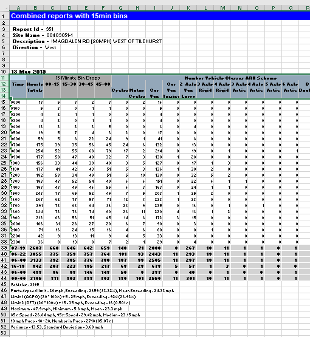
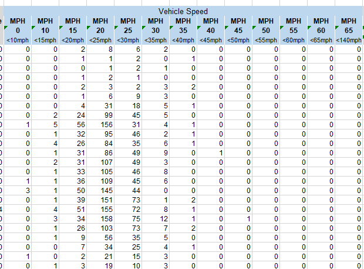
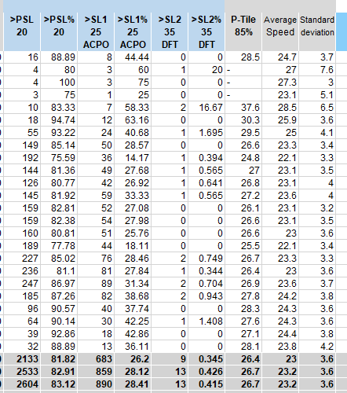
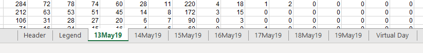

 
A quick look at what you might get back from a local authority. In [a previous post](\making-foi-requests), I looked at how you might request data from a local authority. Now, what do you get?

There's a big caveat on this post - the data received so far from the London Borough of Wandsworth is not strictly raw data. Don't get me wrong, it's an enormous advance on the few data that have been exposed in the past, such as just the overall mean speed. But, in an ideal world, we really would get the really raw data, that is, each record in the dataset would relate to a single vehicle passing the traffic counter at a given time. From that sort of data, you can summarise as you wish. In reality, you may well get a pre-summarised dataset, as I have here. With this kind of dataset, each record is just a total of vehicles within a given time-frame, for example, how many vehicles of each type passed the counter between 0900 and 1000. I guess that in order to create the later dataset, the analyst must do some smoothing and exclusion of outliers. But it would be better to do that yourself.

With the caveat out of the way, this is a quick look at a dataset received from Wandsworth ([FOI request source](https://www.whatdotheyknow.com/request/magdalen_road_earlsfield_traffic#incoming-1397375)).

Here, you can see the hourly time-slots in the first column and then different columns for each vehicle type. The 15 minute "bin drop" enable you to break out the hourly slots into 15 minute slots - for the 0000 row you get the data for 0000-0015 by looking at the 00-15 column and so on. In another post, I'll show how to automate the process of analysing these types of files, including how to put the data in a more useful format.

There are a lot of columns in the dataset, to the right of the vehicle counts are percentage equivalents (eg the percentage of total flow taken up by a particular vehicle type). If you are doing further analysis, you don't need to read these in as they can easily be calculated.

More interestingly, further to the right of the vehicle counts are counts of vehicles at different speeds.

Because this is presummarised data, you're stuck with the bins the analyst has chosen, so no fine-tuned histograms can be made (sad face). Again, to the right of these columns are the equivalent percentages which can be ignored.

Finally, to the right of the speed data are columns which provide the numbers and percentages of vehicles above certain speeds (the posted speed limit, PSL, the speed limit plus 5 mph, SL1, and the limit plus 15 mph, SL2), plus the 85th percentile speed, the mean speed and the standard deviation. For a discussion (albeit US-focused) on the importance of the 85th percentile speed see the pdf at [https://lincoln.ne.gov/city/ltu/engine/traffic/speed-zones/pdf/regulatory-speed-limits.pdf](https://lincoln.ne.gov/city/ltu/engine/traffic/speed-zones/pdf/regulatory-speed-limits.pdf).

But, you may ask that's only one day's worth of data, where's the rest? Well, there are separate worksheets for each day that the survey runs.

Again, I'll cover in another post how to read all the data into a single dataset.

The other worksheets in the workbook are:

- **Header** \- various metadata about the survey
- **Legend** \- some extra information about each column in the dataset
- **Virtual Day** - an average per day of all columns
- **Virtual Weekday** - an average per day (weekdays only) of all columns
- **Virtual Week** - totals for each day and for the week
- **Grand Total** - a single line repeating the total for the previous worksheet
- **ARX scheme** - a useful image outlining the vehicle classification used

I should add one last caveat - what I've shown above is the result of some requests to Wandsworth; other authorities or their contractors may summarise in different ways. It would be much harder to combine and compare data in different formats. Raw data, as mentioned above, would be much better.

In coming posts, I shall how to read these data into R and into Excel or Power BI, and then, finally, what you can do with the data.