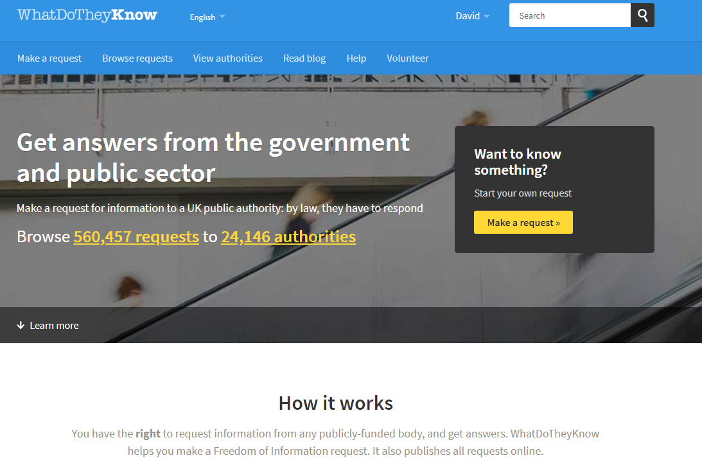

 A brief post on how to make Freedom of Information Requests to request traffic data.

The UK's Freedom of Information Act, together with the related Environmental Information Regulations 2004, provides citizens with rights of access to information held by public bodies. The framework is overseen by the Information Commissioner's Office (https://ico.org.uk/), who also look after the personal data regime - (GDPR/Data Protection Act 2018) - which is not discussed here.

The ICO site is a fantastic resource, particularly if a public body is being reticent about releasing information. The information at [https://ico.org.uk/your-data-matters/official-information/](https://ico.org.uk/your-data-matters/official-information/) is a good primer. There is also some more (limited) information at [https://www.gov.uk/make-a-freedom-of-information-request](https://www.gov.uk/make-a-freedom-of-information-request) .

One important point to make is that you don't need to specify under which legislation you are making a request, it is up to the public body to work out which is the appropriate regime - you can appeal if you think they've got it wrong.

The ICO itself doesn't provide a mechanism for making requests - for that you need the site What do they know? (WDTK) [https://www.whatdotheyknow.com/](https://www.whatdotheyknow.com/).

WDTK enables you to find public bodies, make a direct request to the appropriate body, and then track your request. It even reminds you what to do at various stages of your request. Importantly, it also makes your request and any responses publicly available and searchable by other interested parties, preventing similar requests and providing a repository of information, including any attachments. You will see in other posts that this can be useful in documenting your work. You can search in various ways, including by user, here's mine: [https://www.whatdotheyknow.com/user/david\_knight\_5/requests](https://www.whatdotheyknow.com/user/david_knight_5/requests).

I could write a post about how to use the WDTK site but the blog at My Society (who run the site) already has a [great post](https://www.mysociety.org/2014/08/15/how-to-make-a-freedom-of-information-request-with-whatdotheyknow/). WDTK itself also has [extensive help pages](https://www.whatdotheyknow.com/help/requesting). Do make your requests via WDTK so we can all share in your work. Even better, why not [volunteer to help](https://www.whatdotheyknow.com/help/volunteers) at WDTK?

Since this is a blog about traffic data, I ought to mention to whom you need to direct your request. In the United Kingdom, responsibility for highways is split between that for major roads (trunk or their equivalent roads and motorways) and minor roads (everything else). Major roads are the responsibility of the four national bodies - Highways England, Transport Scotland, the Welsh Government, and Transport NI. Minor roads are generally the responsibility of the upper tier of local authorities (eg county councils where they exist). In London, major roads (red routes) fall to Transport for London (TfL) and minor roads to the Boroughs, although TfL take responsibility for all traffic lights regardless of the road. Some roads in the UK are unadopted (they are not the responsibility of a highways authority) and must be maintained by the road owners, who may well be the owners of properties fronting the road.

You'll see that Wandsworth originally rejected my first request for traffic data. If this happens to you, be patient, do your research and see what you can do to appeal. Each successful request or appeal makes it harder for an authority to refuse other requests. If you would like assistance with requests, please do get in touch with me.

Disclosure - I was the head of the then Department of Social Security information policy (open government and data protection) team during the period of FOI legislation and introduction, and later the policy lead on major road scheme appraisal and team member of the road pricing feasibility study (2003) at the Department for Transport. I left DSS in 1998 and DfT in 2007.
