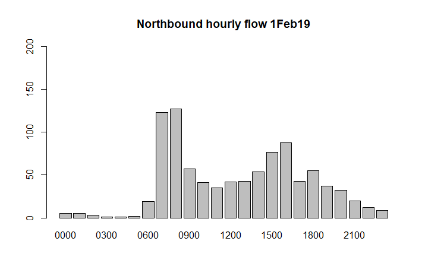
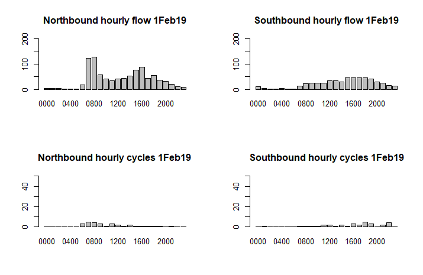
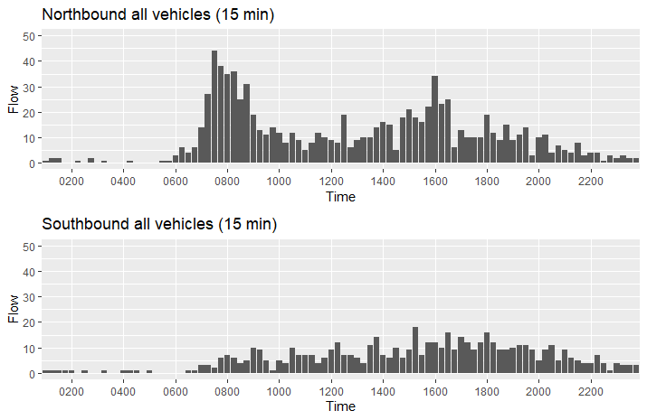
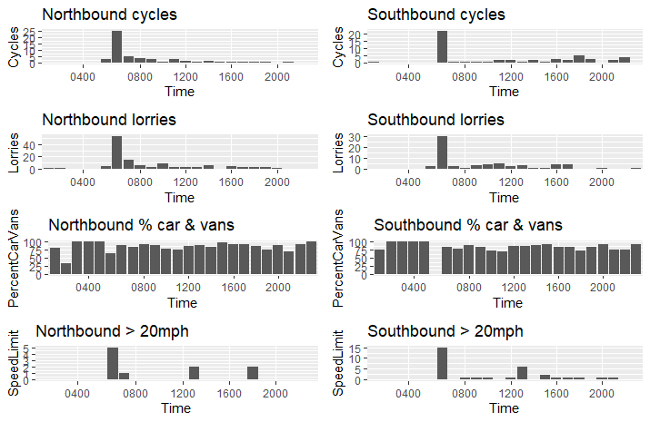

 
So you've got some traffic data, how do we get the data into a dataset so we can analyse it? Let's use the R language to explore the data.

The presummarised datasets outlined in [a previous post](https://www.trafficflows.org/post/a-look-at-some-traffic-data) are not really in a form for further analysis. Sure, you can read off some basic statistics from the Excel workbooks, particularly if you look at the virtual worksheets. But you can't easily compare across days or produce your own summary statistics. This post will give a quick run through of how to read the traffic data into R and show you how to create some graphs, before giving an example of how you can create sophisticated output in pdf format.

## What is R?

R is a computer language which has many benefits for reading, manipulating, analysing and displaying data. You can read more about R at https://www.r-project.org/about.html. You can install R for free on most operating systems; I run it on both Linux and Windows. The RStudio IDE makes a few things easier but it is not necessary to run any of these examples but you may need to install some packages to do more sophisticated things with R. I ran the examples some below in RStudio with R v3.6.0 and have identified which packages you need to install.

This is not an R tutorial, a very basic one is available at https://www.statmethods.net/r-tutorial/index.html but there is a wealth of resources out there.

## Reshaping the data

What have we got and how do we want it? Let's start with thinking about how the data are held in Excel and what shape we want them to be for analysis.

Let's look again at the Excel workbook.


Each sheet with data has several rows before the actual data and the headings are over several lines. We would like the data in a tidy form with no blank rows and each column being named appropriately.

How do we read data from Excel into R? R has many specialised add-ins that extend the language, you need to manually add these packages if you want to use the extenions. I've used the readxl package here to read the Excel data but there are other packages available, notably xlsx. If you haven't installed the package before then install it with:

```
install.packages("readxl")
```

Now let's load it:
```
library("readxl")
```
  
Remember the "useless" beginning rows of each sheet? We need to ignore those when reading the data. We also want only to read the data for each hour and not any extra rows at the end. The read\_excel function uses the skip parameter to determine how many rows to ignore at the beginning of a sheet, and the n\_max parameter for how many rows to read. We want to ignore the first 14 rows and read in the next 24 (one for each hour). You also need to specify which sheet to read - let's get the 1Feb19 sheet:

```
excel_data <-read_excel("TRANMEREROAD20MPHNORTHOFWAYNFLETESTREETNORTHBOUNDxlsx V1.xlsx", sheet="1Feb19", skip=14, n_max=24, col_names=FALSE)
```
  
Read\_excel will try to read the column names from the workbook if you use the col\_names parameter to TRUE but, as we saw, the names are a bit of mess. Using col\_names=FALSE just leaves the column names as sequential numbers.

Let's try and make the code as flexible as possible by setting a variable to count the number of rows to ignore and one to count how many rows to read in after that. We could of course be more sophisticated and look for particular rows such as ones that look like times in the first column. That way, the code could cope with slightly different layouts. However, let's take the easy route:

```
Nskip <- 14
Nrows <- 24
```  
  
Now, each day has a separate sheet. For now, let's just read in one day at a time. Each direction was in a separate workbook, again, let's read those into separate variables and keep flexibility and neatness by storing the workbook names in variables.

```
date <- "1Feb19"
wb1 <- "TRANMEREROAD20MPHNORTHOFWAYNFLETESTREETNORTHBOUNDxlsx V1.xlsx"
wb2 <- "TRANMEREROAD20MPHNORTHOFWAYNFLETESTREETSOUTHBOUNDxlsx V1.xlsx"

excel_data_1 <-read_excel(wb1, sheet=date, skip=Nskip, n_max=Nrows, col_names=FALSE)
excel_data_2 <- read_excel(wb2, sheet=date, skip=Nskip, n_max=Nrows, col_names=FALSE)
```
  
Setting column names is a laborious process if we had to do this each time - see later on for a function to do this.

```
names(excel_data_1)[1:28] <- c("Time","Flow","00-15","15-30","30-45","45-60","Cycles","MotorCycles","CarVan", "CarVanTowing","VanLorry2Axle", "Rigid3Axle","Rigid4Axle","Artic3Axle","Artic4Axle","Artic5Axle","Artic6Axle","BDouble","DoubleRoadTrain","mph10","mph15","mph20","mph25","mph30","mph35","mph40","mph45","mph50")

names(excel_data_2)[1:28] <- c("Time","Flow","00-15","15-30","30-45","45-60","Cycles","MotorCycles","CarVan", "CarVanTowing","VanLorry2Axle", "Rigid3Axle","Rigid4Axle","Artic3Axle","Artic4Axle","Artic5Axle","Artic6Axle","BDouble","DoubleRoadTrain","mph10","mph15","mph20","mph25","mph30","mph35","mph40","mph45","mph50")
```

Copy and paste helps reduce the overhead of tedious code (I edit my code in Notepad++ or NotepadQQ both of which are excellent editors, Vim of course rules in Linux). Note that I've ignored the quarter hour data; more on that later. We'll modularise the code later too.

## What do the data look like now?

```
excel_data_1
# A tibble: 24 x 67
   Time  HourlyTotal  ...3  ...4  ...5  ...6 Cycles MotorCycles CarVan CarVanTowing VanLorry2Axle
   <chr>       <dbl> <dbl> <dbl> <dbl> <dbl>  <dbl>       <dbl>  <dbl>        <dbl>         <dbl>
 1 0000            5     1     0     2     2      0           0      5            0             0
 2 0100            5     1     2     2     0      0           0      4            0             1
 3 0200            3     0     1     0     2      0           1      1            0             1
 4 0300            1     0     1     0     0      0           0      1            0             0
 5 0400            1     0     1     0     0      0           0      1            0             0
 6 0500            2     0     0     1     1      0           0      2            0             0
 7 0600           19     3     6     4     6      3           0     12            0             2
 8 0700          123    14    27    44    38      5           1    103            0            13
 9 0800          127    35    36    25    31      4           1    117            0             5
10 0900           57    19    13    11    14      3           0     51            0             3

```

We can now use these columns directly to do some basic exploration.

Some quick graphs

  
```
barplot(excel_data_1$HourlyTotal, names.arg=excel_data_1$Time, main=paste("Northbound hourly flow", date), ylim=c(0,200))
```



Let's compare the total northerly and southerly flows, and show the figures for cycling separately:

```
par(mfrow=c(2,2))
barplot(excel_data_1$Flow, names.arg=excel_data_1$Time, main=paste("Northbound hourly flow", date), ylim=c(0,200))
barplot(excel_data_2$Flow, names.arg=excel_data_2$Time,main=paste("Southbound hourly flow", date), ylim=c(0,200))

barplot(excel_data_1$Cycles, names.arg=excel_data_1$Time, main=paste("Northbound hourly cycles", date), ylim=c(0,50))
barplot(excel_data_2$Cycles, names.arg=excel_data_2$Time, main=paste("Southbound hourly cycles", date), ylim=c(0,50))
```
  


## Modularise the code

Let's make the code a little more modular by creating a function to read the data and set the column names:

```
get_data <- function(file, sht ,ignore, rows) {

  # read in the data from Excel
new_tibble <- read_excel(file,sheet=sht, skip=ignore, n_max=rows)
  
  # rename the columns (before dropping columns as it's easier to reference)
names(new_tibble)[1:28] <- c("Time","Flow","00-15","15-30","30-45","45-60","Cycles","MotorCycles","CarVan", "CarVanTowing","VanLorry2Axle", "Rigid3Axle","Rigid4Axle","Artic3Axle","Artic4Axle","Artic5Axle","Artic6Axle","BDouble","DoubleRoadTrain","mph10","mph15","mph20","mph25","mph30","mph35","mph40","mph45","mph50")
  
names(new_tibble)[59] <- "SpeedLimit"
  
  # now drop the unused columns
new_tibble <- new_tibble[c(1:28,59)]

  # and create new columns for Lorries and some percentages
new_tibble <- new_tibble %>% mutate(Lorries = Flow - Cycles - CarVan - CarVanTowing - MotorCycles)
new_tibble <- new_tibble %>% mutate(PercentCarVans = CarVan / Flow * 100)
new_tibble <- new_tibble %>% mutate(PerCentLorries = Lorries / Flow * 100)
return (new_tibble)
}
```
  

Note this also creates a new Lorries column plus columns for the percentage of cars and vans, and of lorries. You also need to have loaded the Tidyverse package for this to work:

```
 library("tidyverse")
```
  
We call the function like this:

```
new_excel_data_1 <- get_data(workbook1, dt, sk, rw) 
```

Let's see what the data look like now:
```
new_excel_data_1
# A tibble: 24 x 70
   Time   Flow `00-15` `15-30` `30-45` `45-60` Cycles MotorCycles CarVan CarVanTowing VanLorry2Axle
   <chr> <dbl>   <dbl>   <dbl>   <dbl>   <dbl>  <dbl>       <dbl>  <dbl>        <dbl>         <dbl>
 1 0000      4       1       0       2       2      0           0      4            0             0
 2 0100      3       1       1       2       0      0           0      3            0             1
 3 0200      2       0       1       0       1      0           1      1            0             1
 4 0300      2       0       1       0       1      0           0      1            0             1
 5 0400      1       0       1       0       0      0           0      1            0             0
 6 0500      3       0       0       1       2      1           0      2            0             0
 7 0600     14       3       5       2       5      3           0      9            0             2
 8 0700    128      18      32      37      42      7           1    111            0             9
 9 0800    153      40      38      35      40      5           1    141            0             7
10 0900     75      25      15      14      23      3           1     65            0             6
```

That's better!

## Quarter hour data

What about the quarter hour data, can we break that out and make it usable? Yes we can! We want to reshape the data so that the quarter hour data is attached to each hour, something like this:

```
0000 1
0015 0
0030 2
0045 2
0100 3
0115 1
etc
```

The first thing to do is to select just the quarter hour columns as all the other columns are for each hour. Using the Tidyverse package we can use select and gather to do this. Let's just keep the quarter hour columns:

```
> ed_1_15 <- select(excel_data_1, Time, '00-15','15-30','30-45','45-60')

> ed_1_15
# A tibble: 24 x 5
   Time  `00-15` `15-30` `30-45` `45-60`
   <chr>   <dbl>   <dbl>   <dbl>   <dbl>
 1 0000        1       0       2       2
 2 0100        1       1       2       0
 3 0200        0       1       0       1
 4 0300        0       1       0       1
 5 0400        0       1       0       0
 6 0500        0       0       1       2
 7 0600        3       5       2       5
 8 0700       18      32      37      42
 9 0800       40      38      35      40
10 0900       25      15      14      23
```  

We now want to "gather" the data so that each data column in fact becomes a row in its own right. In Power BI (as a later post will illustrate) this is called "unpivoting".

```
ed_1_15 <- gather(ed_1_15, "QTime", "Flow", -Time)
ed_1_15
# A tibble: 96 x 3
   Time  QTime  Flow
   <chr> <chr> <dbl>
 1 0000  00-15     1
 2 0100  00-15     1
 3 0200  00-15     0
 4 0300  00-15     0
 5 0400  00-15     0
 6 0500  00-15     0
 7 0600  00-15     3
 8 0700  00-15    18
 9 0800  00-15    40
10 0900  00-15    25
# ... with 86 more rows
```

The QTime column is not yet in the proper format for time so we need to create a new column merging the hours of the main Time column with the quarter hour column.

```
ed_1_15 <- ed_1_15 %>% mutate(NewTime=paste(substr(Time,1,2),substr(QTime,1,2),sep=""))
 
Let's look at the end of the data this time to make it more obvious what's happening:
 
tail(ed_1_15)
# A tibble: 6 x 4
  Time  QTime  Flow NewTime
  <chr> <chr> <dbl> <chr>  
1 1800  45-60    16 1845   
2 1900  45-60     5 1945   
3 2000  45-60     8 2045   
4 2100  45-60     3 2145   
5 2200  45-60     2 2245   
6 2300  45-60     2 2345
```  

We used the first two characters of the Time column (eg 18 for 1800) and the first two from the QTime column (eg 45 for 45-60). So 1800 and 45-60 becomes 1845, ie the 15 minute interval starting at 1845.

The Time and QTime columns are now no longer needed so let's drop them, rename the NewTime column and also sort by it:

```
ed_1_15 <- select(ed_1_15, "Time" = NewTime, "Flow")
ed_1_15 <- arrange(ed_1_15, Time)

ed_1_15
# A tibble: 96 x 2
   Time   Flow
   <chr> <dbl>
 1 0000      1
 2 0015      0
 3 0030      2
 4 0045      2
 5 0100      1
 6 0115      1
 7 0130      2
 8 0145      0
 9 0200      0
10 0215      1
```

Written as a function, this becomes:
```
convert_15min <- function(tibble1) {
   new_tibble <- select(tibble1, Time, '00-15','15-30','30-45','45-60')
   new_tibble <- gather(new_tibble, "QTime", "Flow", -Time)
   new_tibble <- new_tibble %>%    mutate(NewTime=paste(substr(Time,1,2),substr(QTime,1,2),sep=""))
   new_tibble <- select(new_tibble, "Time" = NewTime, "Flow")
   new_tibble <- arrange(new_tibble, Time)
   return (new_tibble)
}
```
  

and we'd call this function like this:

```
new_ed_1 <- convert_15min(excel_data_1)
```
 
## Completing the code

Let's create some more modular functions to make plotting easier, using the ggplot2 library for quality output and the gridExtra library to set out the plots neatly:

```
> do_plots1 <-function(label1, label2, tibble1, tibble2) {
   
   p1 <- ggplot(tibble1, aes(y=Flow, x=Time)) + ggtitle(paste(label1, "all vehicles (15 min)")) + scale_x_discrete(breaks=c("0000","0200","0400","0600","0800","1000","1200","1400","1600","1800","2000","2200","2400")) + ylim(0,flow_y_max) + geom_bar(stat="identity")

   p2 <-ggplot(tibble2, aes(y=Flow, x=Time)) + ggtitle(paste(label2, "all vehicles (15 min)")) + scale_x_discrete(breaks=c("0000","0200","0400","0600","0800","1000","1200","1400","1600","1800","2000","2200","2400")) + ylim(0,flow_y_max) + geom_bar(stat="identity")

   grid.arrange(p1,p2,nrow=2)
   
}

do_plots2 <- function(label1, label2, tibble1, tibble2) {

   p1 <-ggplot(tibble1, aes(y=Cycles, x=Time)) + ggtitle(paste(label1, "cycles")) + scale_x_discrete(breaks=c("0000","0400","0800","1200","1600","2000","2400")) + geom_bar(stat="identity")

   p2 <- ggplot(tibble2, aes(y=Cycles, x=Time)) + ggtitle(paste(label2, "cycles")) + scale_x_discrete(breaks=c("0000","0400","0800","1200","1600","2000","2400")) + geom_bar(stat="identity")
   
   p3 <- ggplot(tibble1, aes(y=Lorries, x=Time)) + ggtitle(paste(label1, "lorries")) + scale_x_discrete(breaks=c("0000","0400","0800","1200","1600","2000","2400")) + geom_bar(stat="identity")

   p4 <- ggplot(tibble2, aes(y=Lorries, x=Time)) + ggtitle(paste(label2, "lorries")) + scale_x_discrete(breaks=c("0000","0400","0800","1200","1600","2000","2400")) + geom_bar(stat="identity")
   
   p5 <- ggplot(tibble1, aes(y=PercentCarVans, x=Time)) + ggtitle(paste(label1, "% car & vans")) + scale_x_discrete(breaks=c("0000","0400","0800","1200","1600","2000","2400")) + geom_bar(stat="identity")

   p6 <- ggplot(tibble2, aes(y=PercentCarVans, x=Time)) + ggtitle(paste(label2, "% car & vans")) + scale_x_discrete(breaks=c("0000","0400","0800","1200","1600","2000","2400")) + geom_bar(stat="identity")

   p7 <- ggplot(tibble1, aes(y=SpeedLimit, x=Time)) + ggtitle(paste(label1, "> 20mph")) + scale_x_discrete(breaks=c("0000","0400","0800","1200","1600","2000","2400")) + geom_bar(stat="identity")

   p8 <- ggplot(tibble2, aes(y=SpeedLimit, x=Time)) + ggtitle(paste(label2, "> 20mph")) + scale_x_discrete(breaks=c("0000","0400","0800","1200","1600","2000","2400")) + geom_bar(stat="identity")

   grid.arrange(p1,p2,p3,p4,p5,p6,p7,p8, nrow=4, ncol=2)
   
}

```  

ggplot2 is a very complicated package with its own "grammar" but offers ways of extreme fine-tuning of the output. Note that for the above code to run properly you would need to have loaded the gridExtra package.

## Putting it all together

Given the above functions we can now use them to read in our data and create some decent graphics, all in a way that can be easily reused for other datasets:

```
# let's set some limits for the axes
flow_y_max <- 50 # max y limit
cycle_y_max <- 15 # max y limit

final_data1 <- get_data(wb1, date, Nskip, Nrows)
final_data2 <- get_data(wb2, date, Nskip, Nrows)

final_data1_15 <- convert_15min(final_data1)
final_data2_15 <- convert_15min(final_data2)

do_plots1("Northbound", "Southbound", final_data1_15, final_data2_15)
```



```
do_plots2("Northbound", "Southbound", final_data1, final_data2)
```



## Summary

The above is a very simple way of reading the data more suited to exploring, there are better ways if you want to produce an output worth publishing. R offers knitr and sweave, which provide the benefits of interleaving code and text to make self-commented output. There isn't enough space to discuss either here but I might write another post on that topic.

I hoped you enjoyed this quick exploration of what R can do to read presummarised ATC data. I am still learning R so experienced users will be able to significantly improve on the code. Improvements would usefully merge all the data together so you can see a whole week's data in one go, and be written so that dates etc don't need to be hard-coded.

In a forthcoming post, I will show how to read the data into Power Query and Power BI, which are (un?) arguably much more user friendly than R.