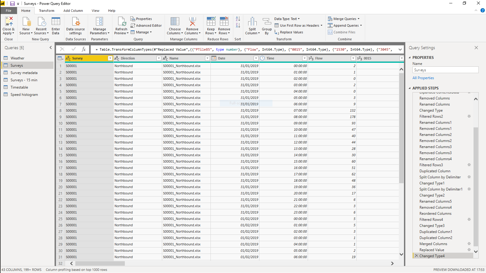
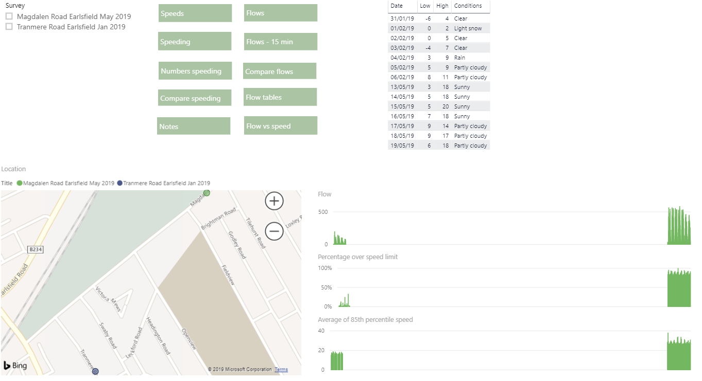
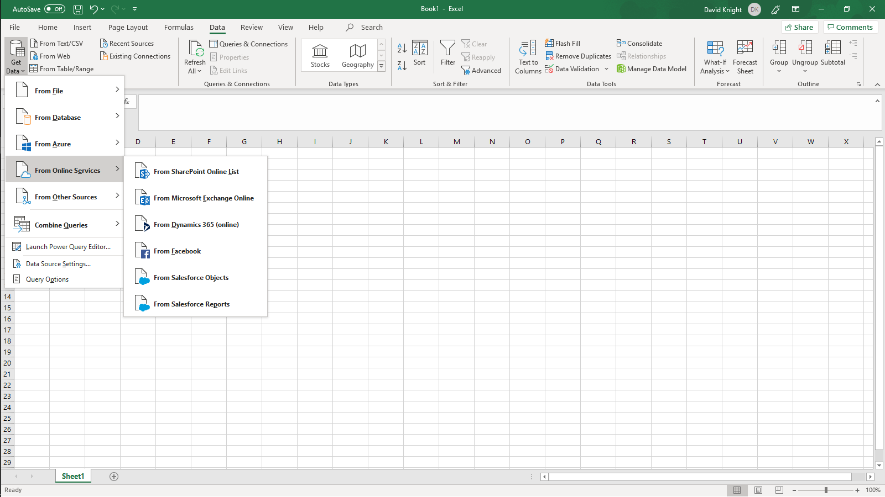

 
OK, so [reading the data into R](/reading-traffic-data-into-r) was too much for you, is there an easier way? Yes! This post will introduce you to Power BI and its half-sister Power Query. This will be the first in a series of posts that will take you through the process of producing interactive charts on the Internet sitting on top of a scalable database.

Rather like R, Power BI provides a method of reading in data, reshaping data and then presenting charts and tables (visualisations). However, although it's possible to do all of this like R in the underlying languages (M and DAX), Power BI is best when using the point and click interface to set up the steps involved. Moreover, the resultant charts are interactive by default so that you can, for example, click on a pie chart slice and then see all related charts filtered by that slice's values.

Like R, you can set up a Power BI report so that it's flexible enough to read in multiple sources and combine them. The potential sources are extensive are always being added to (see [https://docs.microsoft.com/en-us/power-bi/desktop-data-sources](https://docs.microsoft.com/en-us/power-bi/desktop-data-sources) for the latest set). You do not need to install packages like in R to get at a different data source. They are all built into the application. You can even write your own code to query sources not otherwise available (you can, of course, do this in R too).

For me, finding Power BI was like that far distant day in 1988, when my work colleagues showed me how a spreadsheet works. Of course, first they waited until I had spent hours doing the same calculation repeatedly with slightly different values before showing me. The way that you could recalculate the whole sheet having changed parameters was mind-blowing and yet simple to operate, and I think you'll find Power BI or Power Query in Excel will similarly change the way you operate. Done well, queries will save you enormous amounts of time if you ever have to repeatedly combine data sources even if you're not going to display the data in charts. Forget cut and paste, deleting rows and columns, and creating the same formulae again and again, and take up queries! Press refresh once and your work is complete!

You need the Power BI desktop application to create Power BI reports, which are saved in PBIX files and contain everything needed to get the data, set up datasets and then display them. You can [download the application for free](https://www.microsoft.com/en-us/download/details.aspx?id=45331) and you can share the PBIX files directly with anyone else who has the application. They can manually refresh the underlying queries to get any new source data. But Power BI excels (no pun intended) when the reports are shared on the Internet and when you set up automatic refreshes, for example, every hour. You can share reports on the Internet without any licence provided you're content that anyone who has the correct link can read the data. That is obviously no good for confidential data so there is also a, relatively cheap, licensing system whereby only those with the correct license can see the report. There is a more expensive license option for those companies with many users. There are, of course, the usual discounts for non-profits.

Power BI has two main components - the query engine and the visualisation engine. The query engine is also available in Excel as Power Query (within the Data tab of the ribbon). Within either application, you write queries that connect to data sources, manipulate them in various ways, merge them into tables and generally prepare them for visualisations. Queries written in Power BI can be copied to Power Query in Excel and vice versa. Underlying Power Query is the language M. It's not necessary to understand M to write queries but it does help to have at least an elementary understanding so that you can make minor changes.

The Query Editor in Power BI

The visualisation window in Power BI

The Power Query editor in Excel

As well as the obvious visualisation element of the second part of Power BI, within it you can also set up relationships between the different tables and create new columns and measures. A column is a row specific calculation so that each record in a table has a value. A measure only has values within the context of a specific visualisation, for example, the percentage of a value within the selected records. In practice, measures can get extremely complex.

There is no similar concept in Excel to the visualisation side of Power BI, except, I suppose, Excel itself.

You can export Power BI charts to PowerPoint or PDF files, though you lose the interactive nature of the charts. There is currently no easy way to export a single chart short of using the screenshot tool, a situation which I think needs to be remedied.

A typical use case might be for a company to use Power BI to report on its Salesforce data merged with financial data from Xero, Google Analytics data, and various ad hoc spreadsheets located on Sharepoint.

If you want to find out more about Power BI, there's plenty of helpful videos at [https://docs.microsoft.com/en-us/power-bi/desktop-videos](https://docs.microsoft.com/en-us/power-bi/desktop-videos).

In the second part of this series I'll show you the basics of reading data into Power BI and think about the structure of the dataset we need to display the traffic data in a usable form.
