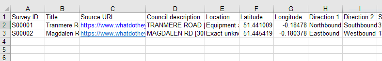
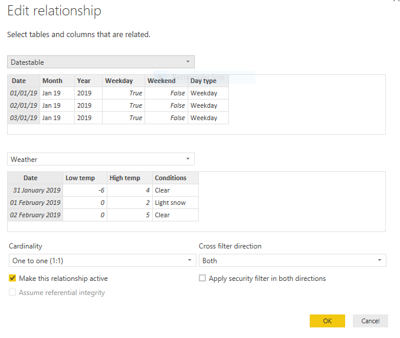

 
Assuming you've downloaded Power BI ([see previous post](/reading-traffic-data-into-power-bi-or-excel-part1)), let's use it to read in some data.

First, let's think about what sources we have and what we might need. Each traffic survey is actually contained within two workbooks (one for each direction) each with separate sheets for each day of the survey. What we want to do is to read those sheets in and combine them into a single dataset for each survey. In fact, why not go one better and read all the surveys into a single dataset? We can then use Power BI to filter the dataset by survey, day or whatever and we only have one dataset to worry about. When we add a new survey to our data source, it just gets read into the portmanteau set. In theory, we can have thousands of surveys (if only!) to play with and Power BI would work exactly the same as if we only had two.

So the structure of the data will look something like this:
```
Survey name, Direction, Date, Time, Flows, etc

```  

But we also need to think about any additional data we might need. One consideration might be the weather during the survey. If one day there was a blizzard, there would likely be much lower traffic flows and speeds. Having weather data gives you some extra understanding of the data.

We might also like to know which days are weekdays and weekends so we can group the data accordingly.

We also need to think about how we name the surveys. The data in the workbooks contain long names. Perhaps simplified names for the workbooks and some kind of look up table might be in order?

Here's the structure I've used so far. It's not necessarily the best and I may not stick to it.

- Date table - holds a list of dates and information about those days - eg weekdays/weekends
- Weather - for every date of any survey, a list of dates together with min/max temperatures and conditions
- Naming table - the lookup table that holds metadata about each survey e.g. location, directions, and notes

Although it's possible to hard code data within a Power BI report, I think it's best to hold the data within an Excel workbook and then read that into Power BI. That way, it's a lot easier to maintain the data, and someone who doesn't understand how Power BI works can still update the data. The exception is the date table, which is easier to maintain in Power BI.

The weather table in Excel


The survey metadata table in Excel


So how do we read these workbooks into Power BI? These workbooks are already in a fairly tidy state so it's really easy. Don't forget, anything you can do in the Query Engine in Power BI, you can do in Power Query in Excel.

Click on Get Data and choose Excel as the source:


Then choose the relevant file and select the first sheet in the workbook, which will be named Sheet1 unless you've given it another name.

Click on Load. Power BI will load the data and jump straight to the visualisation engine. From here you see the actual data by clicking on the table icon on the far-left of the screen. The three icons provide the following views (from the top): visualisations, table, relationship. All three views are still within the visualisation engine,


If you wanted to go back and edit the query that loaded the data, you need to jump to the query engine. Click on Edit Queries and then Edit Queries again. You'll see that the window title changes to Power Query Editor (in fact the query editor window and the visualisation engine window will run quite happily at the same time as separate windows). If, when first setting up the query, you had clicked Edit instead of Load, you would end up in the query editor.


The query you made is shown in the left column - if you've set up multiple queries they will all show here. It's good practice to give your queries useful names, such as Weather, rather than the default names that Power BI allocates - just double click the query name in that column or click on the name in the steps column on the right.

The steps column shows the individual steps taken to load the workbook. If you're good, you'll get into the habit at the beginning of renaming each step with a useful label - right-click on the step and choose Rename. You can click on each step and see the state of the data at each stage. This is really useful for debugging a query that has gone wrong and also when learning for understanding what is going on.

The last step was to change the data type of the columns - sometimes Power BI gets this right but you often have to override it. It is essential that each column has the right data type - if you want to sum numbers it's no use if the column is marked as text. To change the data type, click on the data type icon next to the column name and choose the most appropriate type.

The actual data are shown in the middle, note that Power BI has picked up the column names directly from the workbook, but you can rename them by double clicking on the column header.

The final part of the window (apart from the ribbon) is the M code box. This shows the M code for each step generated by the point and click interface. If you want to see the code for the whole query (for example, to make minor changes or to copy and paste to another query), click on Advanced Editor. See if you can understand any of the code!


You might have noticed that M refers to the previous line in each line of code. It's possible that some queries won't do that but simple queries will.

When you've finished making changes to the query or queries, click on Close and Apply so that your changes are made and the data reloaded.

Repeat the query process to load in the survey metadata workbook and make sure you name the queries appropriately.

Remember that once you've set up the queries, you only need to refresh them if the workbooks change. With complex queries, this saves enormous amounts of time.

Now let's create the date table. This is a simple date table - you will find lots of references on the web to much more complicated date tables. They are essential for business analyses involving change over time but we don't need that complexity for our purposes. We just want a list of dates together with columns for weekends and weekdays.

We will create the date table not in the query engine but in the visualisation engine. Click on the table icon (see above), then in the ribbon Modelling, New Table. You'll see a single cell table. In the code field type the following:

```
Datestable = Calendar( Date(2019, 1, 1), Date(2019,12,31))
```

or whatever range of dates you want and press return. That will create a new column in the table with a datetime field. This is code in the other Power BI language - DAX - which has similarities to functions in Excel. Then click on New Column and type the following:

```
Month = Format('Datestable'[Date],"MMM yy")
```

and repeat for the columns:

```
Year = Format('Datestable'[Date], "yyyy")
Weekday = weekday(Datestable[Date],2) < 6
Weekend = not Datestable[Weekday]
Day type = if(Datestable[Weekday],"Weekday","Weekend")
```

There are several ways of working out which days are weekends and which are weekdays. This is a long way around but is simple to understand. The [DAX Weekday function](https://dax.guide/weekday/) takes a single parameter which specifies which specifies the start of the week, here 2 signifies Monday is returned as 1, Tuesday as 2, etc. So the weekday column is therefore set true if the day of the week is less than 6, ie the day of the week is a weekday. The weekend column is merely the opposite of Weekday. The final column merely returns the words "Weekday" or "Weekend" - this is useful to provide a user-friendly filter interface in Power BI. Note how the structure of the if function is identical to that in Excel.

At any point you can change the dates in the first column and the whole table will recalculate.

The last part of the process for this part is to relate the date and weather tables. This way, whenever you reference a date, you'll also know the weather. In the visualisation window, click on Manage Relationships (either on the Home or Modelling tabs). Click on New and set up the relationship like this:



If you're like me and want to jump ahead and play around and display some of the data in the visualisation window, see the [Microsoft video on adding visualisations](https://docs.microsoft.com/en-us/power-bi/visuals/power-bi-report-add-visualizations-i).

The third part of this series will take you through reading in the actual survey data from the workbooks. That's a little more complicated as we need to deal with multiple workbooks each with multiple worksheets.