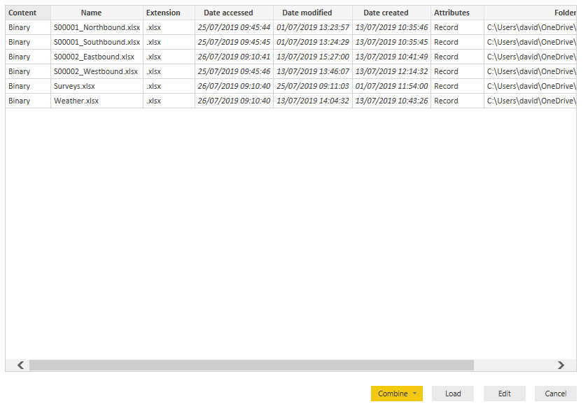

 
In [Part 2 of this series](/reading-traffic-data-into-power-bi-or-excel-part2), we read in the accompanying data, in this part I show you how to read the traffic data from the survey workbooks into our Power BI dataset. I've deliberately separated this out from the other data sources as this is more complex. We want to write the query in such a way that when we add a new survey, all we need to do is refresh the query without rewriting everything. This takes a bit more thought. I hope you find the steps here useful even if you're not reading in traffic data. These are very powerful techniques that can be used whenever you want to read in multiple worksheets from multiple workbooks in a folder. Remember that the steps shown here will work in Power Query in Excel as well as in Power BI but I'll be using the latter in the examples.

We could put the workbooks on a SharePoint site and read them from there but here we'll just store them on a local drive. The former method would be the way to go if multiple users were working on the workbooks. The query you write in that case would be more or lesser identical to that here, you just change the source.

I mentioned previously that we ought to use standardised names for the surveys so it's easier to maintain. I've used the names S00001. S00002, etc. Our lookup table will be used to relate those names to the actual survey names. You might recall that there are two workbooks for each survey - one for each direction (there's also a combined one but that is of limited use to us as we can always recreate it from the other two). Let's now rename the workbooks we've got from [our FOI requests](/a-look-at-some-traffic-data) with the above names and a direction:


With the magic of Power Query we will extract the survey names and directions from the filenames at the same time as getting the data. In Power BI, choose Get Data and this time choose Folder as the source (or SharePoint folder if you are going that route). Browse to the folder holding the above worksheets and you'll end up on this dialog box:



You can see that this is just a list of files in that folder and not only that, it also includes the supplementary files too. We want to filter just to the traffic data files. Click on Edit and you'll see a table in the Power Query Editor window with the same list as above.

First, let's filter this to just the traffic survey workbooks. If you've ever filtered in an Excel table, this is exactly the same process. Click on the drop-down icon next to the Name column heading and choose Text Filters, Begins with S0 like this:


Now only the traffic survey files are visible (it helped to have distinctive names for those files to make the filter easier). If you get the filter wrong, you can either edit the M code directly using the Advanced Editor or you can click on the tool icon next to the Filtered Rows step.
  
When using Power Query you may find it easier to remove columns that are irrelevant to the final outcome. That way, you can focus on what you want to import. In case, we only want the Content and Name columns. You can either use Ctrl and Click to select those columns, right click and choose Remove Other Columns, or select the other columns and choose Remove Columns. Which you choose is up to you and will depend on how many columns you wish to delete.

This is where it gets tricky! We need to get the actual data out of those workbooks into a form that is easy to analyse. Remember we only need to set up this query once and will then read all the files in the above folder - add a new set of survey data into the folder and the query will read it. The next step is to create a custom column which reads the contents of each workbook. Click on Add Column then Custom Column, call the column Contents and add the formula:

```
= Excel.Workbook([Content])
```

Your query table should now look like this:


Now click on that little icon on the right of the Contents header, that will show you the data available in each workbook:


Click on Select All Columns to deselect everything and choose just Name and Data. Then click on OK. Your query should now look like this:


Aha, you can now see the worksheet names, each associated with a table (which contains the actual data). This is looking good! But we've got all the summary sheets as well, let's filter those out by clicking on the drop-down icon next to the sheet name column header and choosing to remove all the non-date fields. Or we can be more clever than that and convert the column into a date field and then remove the errors - click on the type icon to the left of the sheet name column header and choose Date. All the non-date rows will turn to errors - Power Query has failed to convert to dates.


That's ok, just right click on the column header and choose Remove Errors, you'll left with just the ones with dates.


Ok, we've about to see actual data now! Click on the expand data icon on the right of the Data column and click on OK (we'll get all the columns from the worksheets and then tidy them up). Now that looks a bit messy:


We've got lots of unnamed columns and loads of rows that we don't want. Remind yourself what the data look like in the workbooks if you've forgotten - of course it looks very similar to what we're seeing now, except here we've imported all the rows from all the worksheets in all the workbooks in that folder. Scroll down if you don't believe me. Each row is labelled with the source filename (we're going to split that out in a minute) and the date. So we're close to a good dataset.

Can we use a method which is robust to filter out the crud from the data? Why not just filter those rows with times like 0000,0100, etc? That seems the simplest method but an even quicker method would be to convert the column to a Time column and then remove the errors, just like we did with dates above. This time, we also need to remove empty rows as some rows were imported as null and the conversion to Time keeps them as null. To filter out empty rows you need to use the filter drop-down icon rather than right-clicking on the column as you do for removing errors. Slightly inconsistent but I'm sure there's a good reason for it.

At this point, it would be a good idea to rename the columns. Whilst it's possible to bring in the columns names from a spreadsheet, you may recall that the original data names were over several lines. In any case, we want to use our own names. There is little substitute for just typing in this case. Double-click on any column heading and type a new name. Repeat for all the others. If you're on the ball, you may notice that the Editor keeps adding to the M code - if you want and can follow the structure, you can cheat a little and edit the code directly, just watch out and don't confuse your braces and parentheses. Don't forget to rename the workbook name, date and time columns. You can also drop the binary Content column now. You might notice that the data type for all the flow columns are set to ABC/123 - in order to analyse properly later you need these in Whole Number format. Select them all and change them now. Your query table should now look like this:


Now let's split out that first column so we've got separate columns for the survey name and the direction. There are several ways of doing this - we can either duplicate the column and then split it at the underscore and the dot or we can use a formula to do this. Get rid of the .xlsx ending by selecting the Name column, going to the Transform menu and choosing Extract, Text Before Delimiter, enter the delimiter as a full stop. Now split the column into its two parts with Split Column, By Delimiter and choose the delimiter as an underscore (you may find Power Query does this for you). This will split out the column as two new columns - the survey name and the direction. Rename them so you have the following:


Power Query only got those rows from the filenames. Clever huh?

There's one last step in the query - we will want to have a merged date-time column for charts. Again, there are several ways of doing this. Here's one - duplicate both the Date and Time columns (right-click on the column header). The new columns will be on the far-right of your dataset, the Editor will scroll over to them automatically. Highlight both columns and right-click then choose Merge Columns. Use a space as the separator. Then change the data-type to Date-Time and rename the column. You may find it easier if you move this column to the beginning of the dataset - click on Move and then To Beginning. If you're like me and fussy you may then wish to move from the first column. Our dataset now looks like this:


At any point, you can click on the steps on the right of the window to step through the above process and watch the magic. You can also explore the M code by going to the Advanced Editor window. Don't forget to save your work!

There's some more work to do to make the dataset easier to use and to do things like extract the 15 minute flow data but let's leave that to another post. This is a lot to take in - I highly recommend going through the above yourself and trying different techniques. Why not explore this kind of query with other datasets you have? When you get used to it, this technique can save you hours of time.
