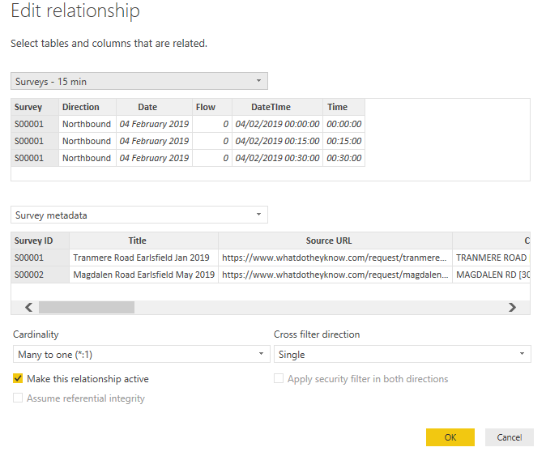
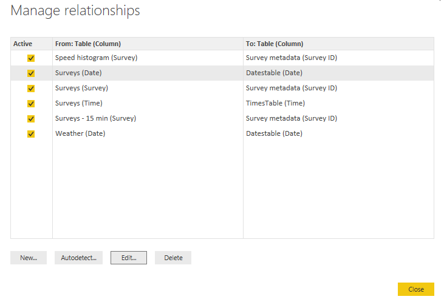

 
In [part 3](/reading-traffic-data-into-power-bi-or-excel-part3), we finally looked at bringing the survey data into Power BI. Let's now tidy that up a bit and bring all the different data tables together so we can start to analyse the data. We'll meet a useful new technique - unpivot.

Just to recap on the last post, we ended up with a nice table with all columns given useful names. If you didn't rename all those columns before, now's the time to do it - double-click on the column headers or right-click and choose Rename. As a guide, these are the names I used:

- Flows - the hourly traffic flows
- 0015 - the quarterly hour flows from 00 to 15 minutes
- 1530 - ditto for 15 to 30
- 3045 - ditto for 30 to 45
- 4500 - ditto for 45 to 60

Then the following for each vehicle class:

- Cycles
- Motorcycles
- Car Van
- Car Van Towing
- 2 axle van
- 3 axle rigid
- 4 axle rigid
- 3 axle artic
- 4 axle artic
- 5 axle artic
- 6 axle artic
- B double
- Double road train

Columns 20 to 32 (ie the ones named that when from the imported worksheets) are not needed as they are the percentage of the above vehicle types, so remove these columns

Then starting with column 33 (as imported) name the columns as:

- MPH0 (ie 0-10 mph)
- MPH10 (ie 10-15 mph)
- MPH15
- MPH20
- MPH25
- MPH30
- MPH35
- MPH40
- MPH45
- MPH50
- MPH55
- MPH60
- MPH65

Again, columns 46 to 58 are the percentages of the above so remove them.

Column 59 is the number of vehicles exceeding the posted speed limit - while we can calculate that from the speed columns above, let's keep this one for now. Rename it PSL and remove the percentage column 60. Similarly columns 61 and 63 are the numbers exceeding the speed limit plus 5 mph and the speed limit plus 15 mph. Rename these as SL1 and SL2 and remove the percentage columns 62 and 64.

The remaining columns 65 to 67 are (for each hour) the 85th percentile speed, the mean speed and the standard deviation of the speed. These are all useful statistics so we need to keep them - rename them as:

- PTile85
- Mean speed
- SD speed

However, some of the values in these last columns are shown as a dash - meaning the figure can't be calculated. As this will cause Power BI problems, we need to change these to null. Select all three columns and choose Replace Values. Set the value to find as a dash and replace with the word null. While we have these columns selected, set their data-type to decimal. If you tried to convert to decimal before removing the dashes you'll get an error. If you haven't done already, select all the other flow columns and set their data-type to whole number. Save your work!

You might have noticed that as you go along, Power BI will often not add a new step when you make a repetitive change like rename a column just after renaming another. All it does is insert a bit extra into the M code for that step (look in the code area or the Advanced Editor to check exactly what it does). However, if you were to rename a column, change its data-type, then rename another column, the two renames become two steps separated by the type change. You can take advantage of this to reduce the number of steps by carefully thinking about the order of the steps you make.

If you look at the resultant table from the above query, you'll notice that you've got the quarter hour flows in this table where they don't really make any sense. What we need to do is something like we did with [R to "gather"/"unpivot" the data](https://www.trafficflows.org/post/reading-traffic-data-into-r). In R, we created a new variable to store the unpivoted data table. How do we do that in Power BI? Well, we could just recreate the query we just wrote and then use that. But that has two problems - firstly, it means reading the data in again (which is wasteful), secondly and more importantly, if we made a change to above query the two queries made become inconsistent. For example, we might decide to read the original query in from a different source. An easier way is to use the original query result as a starting point for a new query, and then the new query can make any further changes for processing the quarter hour data. We do this by creating a reference to the first query.

In the Power Query Editor, right click on the original query name and choose Reference. This means set up a new query, but starting with the result of the original one. If the original one ever changes for some reason, then the new query will get the changed results. The alternative is to create a Duplicate - this will copy the original query's M code and will mean rerunning the query. These queries would now be totally separate and can be changed independently. Do both and look at the M code in the Advanced Editor to see how they differ. You'll see the reference query only has a single line. However, let's stick with a reference query. Rename the new query to Survey - 15 min.

The column Flow and all the columns to the right of the column named 4500 relate to hourly flows so remove them as well as the DateTime column. You might find it easier to highlight the columns you want to keep and choose Remove Other Columns.

Now comes some more Power Query magic - highlight the columns 0015 to 4500 and from the Transform menu (or the right-click menu) choose Unpivot Columns. Just like gather in R, this creates two columns out of the four. Each pair of values is an unfolded version of the columnar data. The first column is called Attribute and in this case refers to the quarterly time period, let's rename it QTime. The table now looks like this:


What does this mean? You need to read the Time and QTime columns together. A Time of 00:00:00 and a QTime of 0015 means the period from 00:00 to 00:15. 00:00:00 and 1530 means 00:15 to 00:30, etc. We need to merge these columns together in a single field so that can use it for charting. We need to extract the hour from the Time field, and the first two digits of QTime to make the minutes. As ever, there are several ways of doing this (and we made it slightly harder on ourselves by changing the data-type of the Time from text earlier). Anyway, create a new column called NewTime with the following formula:

```
=Text.Middle(Time.ToText([Time]),0,2) & Text.Middle([QTime],0,2)
```

This concatenates the two columns in exactly the way we want. We can remove the Time and QTime columns, as their job is done. Removing a column in this way is good practice and won't affect the calculation you've just done. Power Query will not mind that you delete them after you've created the new column.

Now, let's make a new DateTime column using the new time column (the latter should be renamed Time and converted to Time data-type). In the same way as we did for the main survey table, duplicate the Date and Time columns and merge them with a space as separator, call it DateTime. Convert it to Date-time type. You might want to drag the new column to the left a bit. Don't forget to rename the Value column to a more useful name like Flow.

The table show now look like this:


We also need to create two other tables that will help with charting and filtering. We might want to be able to distinguish between peak and non-peak periods in a similar way to how we distinguish between weekdays and weekends in the Dates table. Let's create a Times table and we're going to just type the values directly into a Power Query table. You could of course put these into a workbook and read it in but these values are not likely to change so hard-coding is not such an issue. As ever, there are several ways of doing this including use of a formula but let's type the values.

In the Power Query Editor, click on Enter Data. You'll see a mini-spreadsheet with a single cell. Double-click on the first column and rename it Time. Press Tab to go to the next column and rename it Period. Click into the first data cell in the first column and type 0000, press Tab and type Night in the second column. Click in the first column's second data cell and type 0100, type Night in the second column. If you accidentally create a new column or row, right-click on it and choose Delete. Carry on to 2300, until the table looks like this:


I've renamed the table to TimesTable. Click on OK and change the data type of the Time column to Time. You can, of course, use your own definitions of Period but you're limited to each hour for the vehicle type flows. If you wanted, you could set up a separate Times table for the 15 minute all-vehicle flows - you'd definitely want to use a formula for that one or cheat in Excel and then read it in.

The other table will enable us to produce some slightly nicer histograms, it also demonstrates another use of Unpivot Columns. Create another reference query to the original Survey query. Right-click on it in the Power Query Editor Window and click on Reference. Rename the new query Speed histogram.

Within the new query, remove all the flow columns and the columns PSL to SD speed. The names of the columns MPH0, etc aren't entirely useful for a histogram so let's rename them as 0-10, 10-15, 15-20, etc. I know the first column does not have a 5 mph interval but this is all we have so we're stuck with it.

Now, select all those speed columns and choose Unpivot Columns (either from the right-click menu or from the Transform menu in the ribbon). Just like before, this creates a new set of Attribute, Value columns with pairs of values for each combination in the original data set. Rename these columns as Speed and N. This table may not look very helpful for now, but you'll see later how we can chart this table.

That's it for Power Query. We should now have the following queries set up:

- Surveys
- Surveys - 15 min
- Weather
- Survey metadata
- TimesTable
- Speed histogram
  
We also have the Dates table in the visualisation window (you won't be able to see it in the Power Query Editor window).

Let's now relate these tables together. We have to go to the Visualisation window to do this. This may seem a bit strange at first since relationships seem like a query thing but remember you might wish (as indeed we do here) to relate to a table created in the Visualisation window.

Just to make sure all the queries have run properly, click Close and Apply in the Power Query Editor window. Then click on Manage Relationships. You may find that Power BI has automatically related some tables. Sometimes it gets it right, sometimes not, so always check. Any table with a survey column needs to be related to the Survey metadata table using the Survey ID column like this:



Set up all the following relationships:



So now we've got all the data into Power BI and related all the tables. In the next post, I'll show you how to actually create some visualisations in Power BI. Again, use the video at [https://docs.microsoft.com/en-us/power-bi/visuals/power-bi-report-add-visualizations-i](https://docs.microsoft.com/en-us/power-bi/visuals/power-bi-report-add-visualizations-i) if you want to rush ahead.