 
In this post, we'll get to see what Power BI can do to visualise the data. OK, so this isn't really Excel related any more but it's part of a series so please don't get at me about the title.

I'll assume you've followed all the steps so far and got all seven tables prepared (including the Dates table) and have set up the relations. Now we use the visualisation side of Power BI to table or chart the data in ways that are useful. Let's check out the various parts of that window:

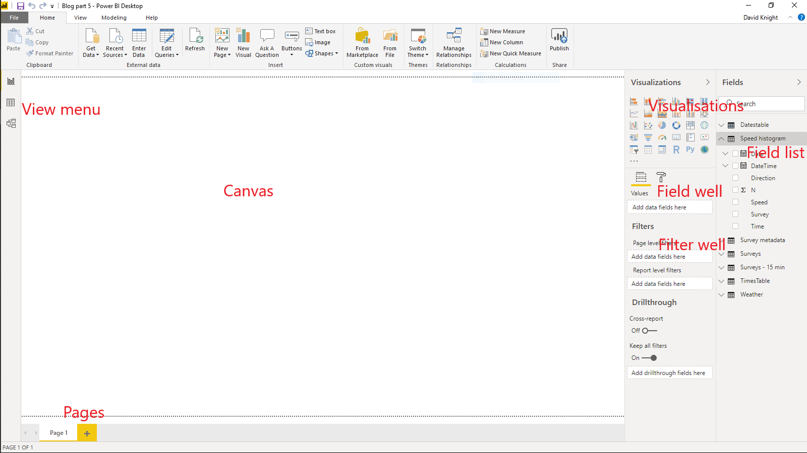

The primary parts are:

- View menu - choose between the canvas view (shown), the data table view or the relationship view (click on the three options to explore)
- Canvas - here's where you draw the different visuals
- Visualisations - the available charts etc (you can add new ones from the market place)
- Field list - all the available tables and their respective fields (both columns and measures)
- Field well - the fields you've chosen for the current visual
- Filter well - the fields you've chosen to filter the current visual
- Pages - you can have as many pages as you want, rename them by double-clicking on the name

The fields used to filter a visual do not necessarily have to be displayed within it. For example, you might filter the traffic dataset to just one survey and direction but only the flows might be shown. There are three levels of filters:

- Visualisation - the filter operates only on the current visualisation - other visualisations on the same page may have different filters (including none)
- Page - the filter operates on all visualisations on the page
- Report - the filter operates on all visualisations on all pages

You can layer filters, for example, your report might filter on one survey, then a page might filter on a particular direction and finally a visualisation might look at just a selection of hours. The order of precedence is always report - page - visualisation. If a higher level filter is in place, then the lower ones can't override it. There's an even higher level of precedence - if the underlying query filters out data then no visualisation has access to those data. Remember all those rows will filtered out in the queries? As far as the visualisations are concerned, those data just don't exist.

Let's create a simple table of data. In the visualisations selection, hover over each visual until you find the Table one (clue, it looks like a spreadsheet but don't get it confused with the Matrix one, which looks similar). Click on it and a template table will show on the canvas. You can resize the table by dragging the corners and move it by dragging the top. Let's add some fields from the Survey table. You can find fields in two ways - either click on the drop-down arrow next to the Survey table and then either tick them or drag them to the field list. The alternative is to type the name (or part of the name) of the field in the search bar above the field well - all matches will be shown. Let's drag the Car Van field to the Values field in the field well. What you'll see at this point is just a single figure - why is this? There's no context for the table, so all Power BI has done is total all the figures for that column. You can change the summary figure by clicking on the drop-down menu next to the field in the field well. Hint - if you don't see appropriate summary functions for a numeric field then you haven't set its data-type properly in the query editor. If you change the summary to Don't summarise, you'll get a list of all the possible values of that field. Change it back to Sum.

Now drag the DateTime field into the table - you can rearrange the column order in the field well. You should see something like this:

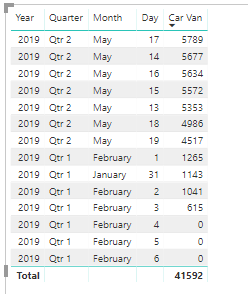

That's not quite what we want. What Power Bi has done here is to use its built-in date hierarchy to aggregate the data to each day (and we could do it to quarters etc). That's all very well for financial data but we want actual date time values. In the field well, click on drop-down menu on the right of DateTime and select DateTime instead of Date Hierarchy. Then click on the DateTime column in the table to sort by it. The table now looks like this:

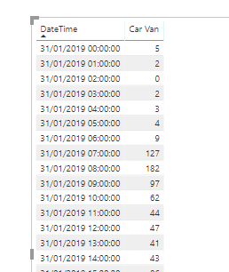

How do we filter to just one survey (or by any particular dimension)? Drag the field you wish to use as a filter to the filter well. Here I've dragged the Survey field to the Visualisation filter and then set it to just S00001 (I'll leave you to play around and find out all the other filter options).

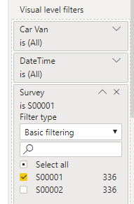

Can we make the filter more dynamic so that the user can choose it without having to play around with the filter well? We can use a Filter visual which does just that. Although you can change the way visuals interact, the default is that a filter visual will limit down the data on a page in exactly the same way as a Page filter.

It's important to deselect a visual before selecting another one unless you wish to change the current visual to another type (this is fun but hold on for a moment). Remove the filter from the table by clicking on the little cross to the right of it. Then click anywhere in blank space on the canvas to deselect the table. In the visualisation selection find the visual that looks like a table with a funnel. Click on it, resize it and place it on the canvas somewhere tidy. Now instead of using the survey ID, let's drag the Title field from the Survey Metadata table into the Field well for the Filter visual. Remember that we related the Survey and Survey Metadata tables so we can use the title field to filter the actual survey data.

The default settings for a filter visual are for only one value to be selected at one time unless you hold down Ctrl. You can change the settings for any visual by clicking on little paint-roller icon above the field-well. The settings for a filter visual are shown below:

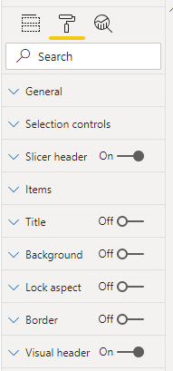

Open out the Selection controls and choose the following settings:

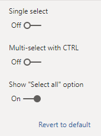

which gives the following look to the filter:

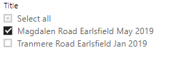

Play around with all the settings to explore. Try dragging the date field from the Dates table to a new filter visual - what does it look like?

Above I said to deselect a visual before adding a new one. If you don't then the currently selected visual will morph as closely as possible to the new type using existing fields. This can be useful. It may be that the new type doesn't need as many fields as the old one, in which case Power BI will ignore the superfluous fields, or it may need more in which case it will not properly display the new visual until you supply more fields. Let's convert the existing table into a histogram (well, really a bar chart).

Select the table by clicking anywhere within it. Now click on the Clustered column chart icon in the visualisation selection pane. The table converts straightaway using the first column as the x axis and the second as the y axis. You might want to play around with the proportions of your chart to make it more pleasing.

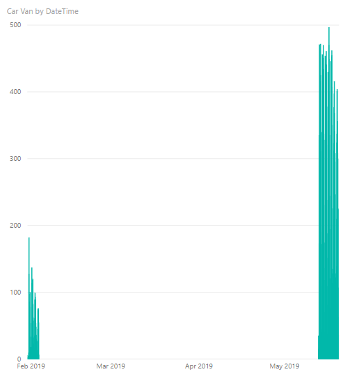

Why is there such a gap between the dates? That's because the two surveys were carried out in different periods and the chart is showing all the dates in between. If you still got the survey title in your filter visual you can limit the dataset just to one survey:

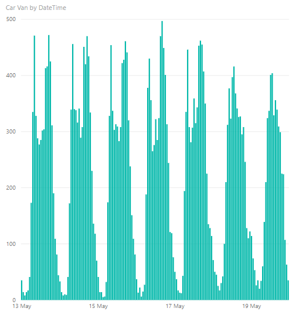

Powerful, isn't it? If you hover over each bar on the chart you see a tooltip pop up that shows the underlying data. You can also add other fields to the tooltip by dragging them to the Tooltips value in the field well.

Map visuals are my favourites. There are two map visuals available in the default visuals set. Let's use the one just called Map. Create a new page by clicking on the plus sign at the bottom of the window. To locate data on this map you need either a postcode or latitude/longitude pairs. I'd recommend the latter if you want to really pin-point a location - a postcode can cover a surprisingly large area.

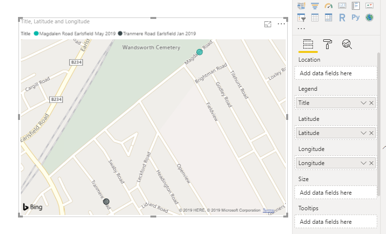

You can also use the legend (or a data point) from a visual as a filter - click on a value in the legend or on a data-point and all other visuals will use that as a filter (if they don't in any way reference that data then the other visuals will ignore the filter).

The matrix visual is useful if you want to summarise data quickly. The following matrix shows the total numbers for each survey and each direction for the two lowest speed columns.

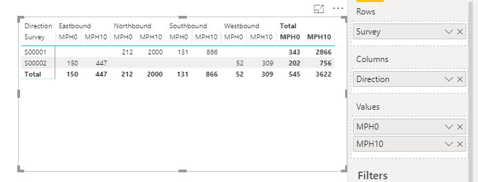

You can change the summary function from Sum to something else by clicking on the drop-down icon next to the field name in the Values box (or by right-clicking on the name). Power BI will rename the columns to (for example) Average of ... You can set your own names by right-clicking on the name in the Values box and choosing Rename.

Be very careful how you interpret the results, here I've changed the summary function to Average (ie mean) and changed the titles:

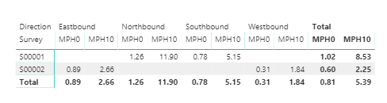

Remember that we're using pre-summarised data and the unit of observation is the hour. So here, the value 0.89 for MPH0 S00002 Eastbound means that for that survey the average number of vehicles travelling between 0 and 10 mph in each hour was 0.89. Across all surveys and all directions the average figure was 0.81.

You're not limited to the visuals in the visualisation selection pane. You can get new ones from the Marketplace - most of which are free. Click on (Custom Visuals) From Marketplace. Find the chart you want and click on Add. It will be available in the report you added it to, until you choose to remove it. You don't actually have to use a custom visual that you've made available. If your needs are specialist, you can also create a visual using R code. This is exceptionally powerful as you can use any R code and do things native Power BI doesn't let you.

There is so much you can do with all the above visuals, do play and explore, it's the best way to learn. The information you've read so far, together with what you'll learn by exploring, will enable you to read in data, manipulate data, and create sophisticated reports. The next post will show you how to share those reports with other people.
