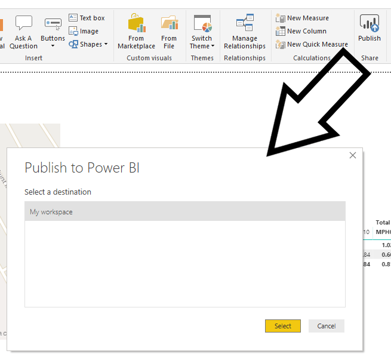

 
In the [last post](/reading-traffic-data-into-power-bi-or-excel-part5), we added some visuals into our Power BI report. I hope you had fun playing with the visuals! Now we're going to share our work with other people.

You have several options when sharing Power BI reports:

1. Export the PBIX file to PowerPoint or PDF formats
2. Send the other users a copy of the PBIX file
3. Publish the report to the Internet and share with anyone
4. Publish the report to a limited number of people

Both 3 and 4 can either be on the Power BI website or embedded in your own website.

1 is the easiest for the consumer of the report. Most users will have a copy of PowerPoint or a compatible application or an application that can read PDF files. However, and this is a biggie, the reports will not be interactive. Users will not be able to click on a filter or visual and see other visuals filtered. If you are aiming to produce a report for this kind of static output then you would be wise to consider this in your design.

2 is the easiest for the creator of the report but has several drawbacks. The other user needs to download not only the report file but also a copy of Power BI desktop. They will be able to change the report and look at all of the queries. This level of user interaction may be useful for other users to learn but may not be what you want if you just want them to see the visuals.

3 means that anyone who has the report link can see your report. This may be good if you really want the whole world to be able to see your work but won't be helpful if you are reporting on your company's secret plans or if there are personal data in the report. This is not a secure method of sharing.

4 is the model used in most companies to share reports securely but you will need licenses to cover all the consumers of the reports. This may work out expensive depending on the number of users - see Reza Rad's [simple guide to licensing](https://radacad.com/power-bi-licensing-walk-through-guide).

So let's run through each of these options.

Oddly you can't yet export to PowerPoint until you've published to the Internet (see below). You can however publish to PDF direct from the desktop application. This is as simple as clicking File, Export to PDF. This will run through your report to create a separate page in a PDF file for each page in your report. You can then email it or send a link to it on OneDrive, Dropbox or similar. Sending a copy of the PBIX file itself is trivial.

If you want to publish so that anyone can see your report, you need to go through a two-step process. Firstly, click on Publish (in the Home tab). Unless you are in an organisation with Groups set up (see later), you will only have the option of publishing to "My workspace". This is an area on the Power BI website that only you can access.

Click on Select. If you've already published the report, you'll be asked to confirm overwriting it. After a short while, Power BI will give you a success report and ask if you want to open the file in Power BI (by this, it means the Power BI website). Click the link offered and it will open in your browser. You can now see your report and interact with it in exactly the same way as in the desktop application. You can also edit the report but I wouldn't advise this except for small changes.

If you uploaded the report to the "My workspace" area then only you can see it. From here, you can finally export to a PowerPoint file by clicking on Export, Export to PowerPoint. You can also share the report with other single users by clicking on Share. However, only licensed users will be to see a report shared in that way and it's not the most efficient way to share within a company structure (see later).

If you want to publish to everyone, click on the ellipses, Embed, Publish to Web (public). You will then receive a URL you can send to other users. They do not have to have a license to see the report. Remember: anyone with that link can see the data. If you later update your report, upload it again to "My workspace". You do not need to Publish to Web again, as that the report at the published link will get updated. However, the update process may not be immediate. If you do Publish to Web again, you will generate a new URL. If you are using a URL redirect or some other method of referencing the rather obscure URL that Power BI generates, you will need to update that.

If you are working within company, the best way of sharing is to set up Groups. Then, instead of publishing to your own workspace from the desktop application, you publish direct to that group. You do not need to do anything else for your colleagues to see the report. However, the other users will all need a license.

This post brings to an end this rather brief introduction to using Power BI. I hope you've enjoyed it and that you agree with me that Power BI and Power Query in Excel offer you some extremely powerful tools. I'll add some other posts over the next weeks on a few related matters but you should have enough here to manipulate and display data, and then share it with others. Do let me know how you get on!