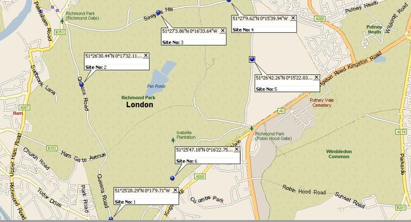
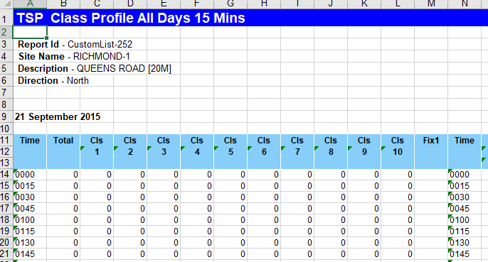
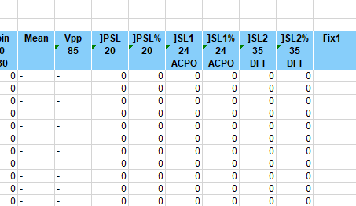
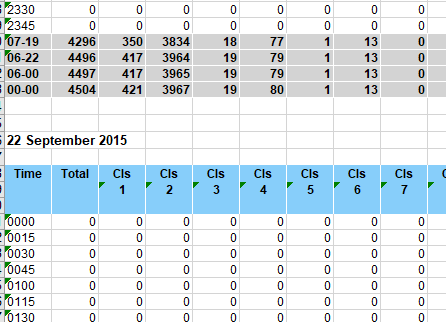
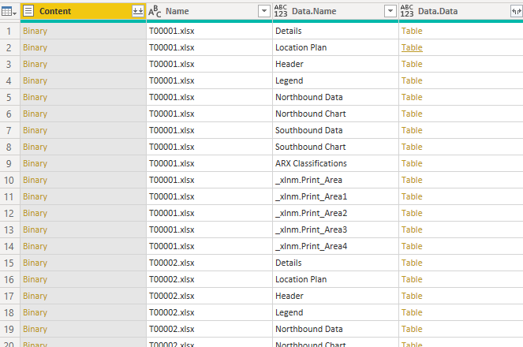
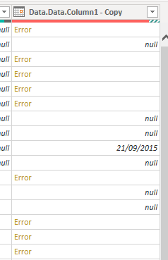
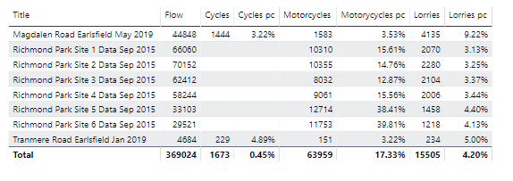
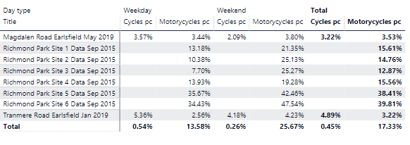
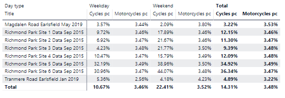
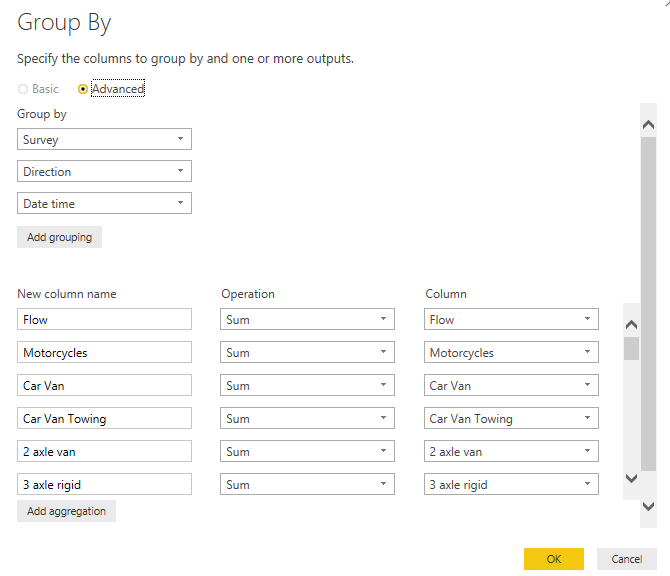

 
Well, it had to happen didn't it? The next traffic surveys, [a bunch of slightly dated Richmond Park data](https://www.whatdotheyknow.com/request/richmond_park_automatic_travel_c#outgoing-925111), use a different layout. So this brings forward what I was thought I was going to do anyway - have separate tables for each input type and then merge together into the main tables. It also allows me to introduce several other features of Power Query/M - fill-down and merge. This is necessarily a long read as it means revisiting steps that were covered in several previous posts. Still, the obstacle is the way!

The new layout is interesting and shows that the same kind of data can often be provided in completely different shapes. The datasets for Tranmere Road and Magdalen Road have separate workbooks for each survey and each direction, dates being in separate worksheets, with meta-data and summary data like virtual week also in separate sheets. The Richmond Park datasets on the other hand only have one workbook per survey, with the data for each direction being in separate worksheets (also with meta-data sheets including a really useful map). But the crux of the difference is that instead of separate sheets for each date, the days are all mixed in the single direction sheets. Not only that, but within the sheets the format is (simplifying greatly):

```
Date 1
data
data
data

Date 2
data
data
data

Date 3
data
data
data
```

ie the traffic data are grouped by date with loads of blank and useless rows - and, awkwardly, the virtual week/day data are also contained at the bottom of those sheets.

One final issue is that all data (not just total flows) are provided in 15 minute segments. This, of course, is more granular (better?) than the 60 minutes in the previous sets but the wealth of information provides a new problem for merging the data. In the original datasets, the 15 minute data needed to be teased out of the 60 minute tables. Here, the 15 minute data will be the base, and we'll need to sum up to 60 minutes to be able to merge with the original base. In addition, we need to decide what to do with the extra columns (or missing columns in the original surveys depending on which way you look at it).

It's pretty clear that, due to these different layouts, whatever method we use to bring in the data we will need to be able to distinguish between the two types of dataset. We also need to think ahead to the probable need for further types in the future. Can we make it easier to introduce yet another layout?

We started by calling the original surveys S00001 etc, so why not create a new set of numbers to denote the new surveys? I've used T00001, etc. Perhaps I should reset to A, B, etc? There are other ways of doing this, which could well be an improvement, but for now the S and T naming convention will do.

The query flow so far has been:

1. Read in base data (60 minutes)
2. Reshape to get the 15 minute data
3. Any secondary queries for 60 minute and 15 minute data (so far only the speed histogram)
4. (Visuals)

Now it needs to be:

1. Read in base data for S surveys (60 minutes)
2. Reshape to get the 15 minute data for S surveys
3. Read in base data for T surveys (15 minutes)
4. Summarise to 60 minute data for T surveys
5. Merge S and T 60 minute data
6. Merge S and T 15 minute data
7. Secondary queries for 60 minute and 15 minute data
8. (Visuals)

If we write the new flow carefully it should then be possible to slot in any further new survey types before the mergers and we don't need to touch anything later in the chain. Let's take the pain of reorganising the flow now.

One major point arises even before we get near bringing in the T data. All the visuals we've created so far work off the tables created by the queries for the S data. We'd rather not recreate all these if we can help it. There's a quick cheat for this I'll address later.

We also need to consider how the relationships will work. Since the S and T data queries are only a stepping stone to the full 60 and 15 minute tables, we want the relationships to be between these full tables and the weather, survey meta-data and other tables. So we'll need to break many of the existing relationships and add new ones to the merged data tables.

One other issue, I mentioned that the T datasets contain 15 minute level data for all columns not just flow. For now, I'll drop these extra columns but at a later stage we might want to use them so we might be better off keeping a separate T query with all columns and a second query merely referencing that and dropping the extra columns. In any case, we will need those extra columns to summarise up to the 60 minute level. This second query will be the one merged with the S data.

1. Read in base data for S surveys (60 minutes)
2. Reshape to get the 15 minute data for S surveys
3. Read in base data for T surveys (15 minutes)
4. Summarise to 60 minute data for T surveys
5. Merge S and T 60 minute data
6. Drop extra columns for T surveys (15 minutes)
7. Merge S and T 15 minute data
8. Secondary queries for 60 minute and 15 minute surveys
9. (Visuals)

Let's now dive into the T data workbooks. There is one workbook per survey. Each workbook has the following worksheets:

- Details
- Location plan
- Header
- Legend
- Xbound data (eg Northbound data)
- Xbound chart
- Ybound data (eg Southbound data)
- Ybound chart
- ARX classification

The location plan very helpfully provides the latitude and longitude (though in DMS rather than D.ddd format, [easily fixed](https://www.latlong.net/degrees-minutes-seconds-to-decimal-degrees)) for each survey and map to confirm the exact position.



## The new data structure  

The data sheets are the only thing we need to import so let's look at those in more detail.



After some preliminary rows which can be ignored, we have a single date cell, followed by a blank row, the column headings, then the data. The first column is the time (on the above date) or, rather, 15 minute segments starting with the given time. The second column is just the flow, then the next columns are the 10 vehicle classes - the ARX classification at the end lists them as:

1. Cycles or Motorcycles (shows Motorcycles as the "dominant" vehicle
2. Car
3. Car towing
4. 2 axle truck or bus
5. 3 axle truck or bus
6. 4 axle truck
7. 3 axle artic
8. 4 axle artic
9. 5 axle artic
10. 6 axle artic

(13. Unclassified - not provided in the dataset)

Class 1 is clearly going to be another issue - it merges cycles and motorcycles. This is inconsistent with our S surveys. The other columns are broadly the same though some of the larger vehicle classifications are missing. We need to decide what to do with these inconsistencies.

The Fix1 column isn't used. The Time is then repeated then we have the columns:


Again we have an inconsistency - for some reason the S surveys didn't have a column for 0-5 mph but the T surveys do. We're not that interested in slow speeds (except perhaps for speed/flow scatter-plots) so we will merge the first two columns of the T surveys into a 0-10 mph column.

The final columns should be familiar, though there is no standard deviation of speed and the SL1 column is speed limit plus 4 mph (not 5 mph). I don't think either of these is anything to make much fuss about. The final Fix1 column is not used.



There are no percentage columns at all so we have less columns to remove.

As mentioned above the data are grouped by date so at the end of the first date's data (plus summary rows for day period) we have the next date's data:



This carries on until the groups for:

- Virtual Day (7) - a set of hourly figures
- Virtual Week (1) - a set for each day
- Grand Total - a single row of data
  

We can recreate these groups if we want so there is no reason to import them.

Each direction is in a separate worksheet - the pattern described above is identical for both directions.

You should remember from previous posts that we can easily bring the data for each worksheet in all workbooks into a single sheet. You might even work out that we filter out the non-data worksheets by filtering on sheets ending "bound Data" and that we can use the time and date type conversions to help with the row filtering. However, the position of the dates is a real problem. We want every row to have the correct date assigned to it. We want to move from:


```
Date
data1 data2 data3
data1 data2 data3
data1 data2 data3
```
to
```
Date data1 data2 data3
Date data1 data2 data3
Date data1 data2 data3
```
  

This is where fill-down comes into play.

## Importing

Let's go through the steps we need to take to import the T dataset. I won't show all the screenshots since much of this has been covered in previous posts.

1. Get data, folder
2. Filter to just the T survey files
3. Remove any extraneous columns (you only need Content and Name)
4. Add a custom column, Data = Excel.Workbook(\[Content\]) 
5. Expand the Data column so you now have this:



6. Now filter the Data.Name column to just those ending in "bound Data"
7. Still on that column, Transform, Replace values " Data" to ""
8. Rename that column Direction
9. Expand the Data.Data column (you might have discovered the Default column name prefix option by now - set this to blank if you don't want names like I use such as Data.Data.Column1!)
10. Now we get to the interesting part, remember those pesky Virtual Day (7) etc groups? We need to deal with those. Here's one method (bear with me, it will become more obvious as you go along). For each of "Virtual Day (7)", "Virtual Week (1)" and "Grand total", replace values for the first expanded column to 1/1/1901. That's three separate replace values commands.
11. Duplicate that column and scroll over to the copy.
12. Change the type of the duplicate column to Date Time. You should now have a column with a few dates, some nulls where there were blank rows and some errors where there were data or text rows that can't be converted to date times. Then convert the column again to Date. Why this two stage process? Unfortunately if you convert to straight to date then time values get successfully converted to dates. Try it and see.



13. Replace errors with null so now you've got a column of nulls except for the dates at the head of each group (and keep bearing with me on the 1/1/1901 dates, they're still in there too)
14. Now for fill-down! Right-click on the column and choose Fill, Down. What fill-down does is look for the first non-null value in a column, it will then use that value for all rows below it until it finds another non-null value. It then uses the new value and so on. For example:

  
```
date1
null
null
null
date2
null
null
null
date3
etc
```

becomes

```
date1
date1
date1
date2
date2
date2
date3
etc
```  

15. Rename this new column Date
16. But we're still left with the extraneous rows, let's use the technique we're learnt from previous posts - convert the time column (column 1 of the expanded worksheets) and remove errors. Remove the extra null rows with filter column
17. Remember the 1/1/1901 dates for the virtual totals? Now just filter those out too. By converting them to a date beforehand, we've made it trivial to select those rows
18. Rename that first column Time
19. If you still have it, you can get rid of the binary Content column
20. Move the Date and Time columns to the beginning
21. Rename the (file)Name column to Survey and use Replace values to remove the .xslx
22. Now go through and rename all the flow columns (see later for the inconsistent columns)
23. Remove any unneeded columns like Fix1, the extra Time column and the PSL, SL1, SL2 proportions
24. For mean speed and Ptile85, replace "-" with null
25. Create a date time column by duplicating date and time and then merging them with a space as the delimiter, convert to date time type, move it to the beginning, rename it to Date time (ie the same as in the S dataset) and sort the entire dataset by it

That was a lot of steps but hopefully it's easy enough to follow what is going on. One other way of dealing with the Virtual groups would just be to chop off those rows but that would be no fun!

## Inconsistencies

What about the inconsistencies in the data. Let's take them one by one:

Cycles or motorcycles? Given that the ARX classifications in the workbooks state that Motorcycles is the dominant vehicle type for Class 1, I originally allocated the entire class to motorcycles. However, the S surveys also purportedly use the same scheme but somehow pull out the cyclists. I do not know how they have done this. The lack of cyclists is obviously a deficiency in the dataset for a place like Richmond Park, almost alone in London (except perhaps Regents Park) in its magnetism for cyclists. On the other hand, I do wonder about how accurate ATC equipment is for distinguishing a heavy cyclist from, say, a light moped. However, I then looked at the data and compared with the other surveys in the entire dataset (here with the entire Richmond Park class 1 allocated to motorcycles :



The proportion for motorcycles in Richmond Park is way out of step with those for Tranmere Road (an ordinary residential road) and Magdalen Road (a cycle "quietway"). In addition, the Site 5 and Site 6 surveys have an even higher proportion of cycles. As discussed elsewhere in this blog, these surveys are off the main commuter cut-through routes so this is exactly what we'd expect if the data are referring to people using the Park for recreational cycling. Moreover, the proportions for the weekend are even more telling:



We have no reason to think that motorcyclists have a particular predilection for Richmond Park, so we have to assume that the bulk of the Class 1 is made up of cyclists. We then have to decide whether to allocate the whole of Class 1 to cycles. This would clearly be overestimating self-propelled two-wheelers and ignoring motorcyclists. A better way would be to use the proportions of motorcycles (let's use 3.5% as a rough estimate) from other surveys as an estimate and then allocate the remainder to cycles. That is,

```
Motorcycles = Flow * 0.035
Cycles = Class - Motorcycles
```
  

This is clearly still flawed - we don't know whether motorcyclists are more or less likely to use Richmond Park than other roads. Also, we don't know the day and time distribution of the proportion - nearly all vehicles using the park outside the official opening times are likely to be cycles. However, an explicit proportion of 3.5% for motorcycles is one step better than an implicit assumption of 0%.

The process for the calculation (done in the T survey query) is simple enough - Class 1 should be named as something other than Motorcycles or Cycles (say, "Class 1"). Then create custom columns for Motorcycles and Cycles using the above formulae. In fact, since we want all flow columns to be whole numbers and we want to avoid edge cases where Cycles would be calculated as negative, the formulae should be:

```
Motorcycles = [Flow] * 0.035
Cycles = List.Max({[Class 1] - [Flow] * 0.035, 0})
```  

Either way, there may be some rounding errors - the sum of all vehicles may not add exactly to the Flow column. This gives us:



MPH - nothing for this but to add up MPH0 and MPH5 to a temporary custom column in the T survey query, remove the MPH0 and MPH5 columns and rename the temporary column MPH0

Lorries - the absence from the dataset of the heavier lorry types is not a major issue. One would not expect these to be in Richmond Park at all.

## A short interlude

One thing you may notice is that the Site 4 survey data clearly has a glitch on 25 September with effectively no data all day in either direction. I don't know if this is a survey issue (similar to the Tranmere Road data where someone parked on the measuring tube) or an error by whoever put the data together. Or perhaps there was an event on that affected only that stretch of road. Given the age of the data, I don't propose to investigate.

The shape of the traffic flows over the day is interesting. On weekdays, the shape is u-shaped, on weekends it's a rough n (but see what happens to weekday flows when you filter by direction!). The Park is heavily used as a cut-through for commuters during the week and very popular during the day at the weekend.

In addition, sites 5 and 6 get noticeably lower flows. The other sites are all on obvious cut-throughs. The gate at Stag Lodge is permanently closed and there is less time to be saved by coming into the park at Kingston gate and out at Roehampton gate or vice versa.

## Group by 60 minutes

OK, we've now got the 15 minute T data imported into Power BI with all the extra data columns that the 15 minute S dataset doesn't have (but is included in the 60 minute S dataset). We first need to summarise these data to 60 minute segments. We need to convert the Time column to the hour component and then sum up all data columns. The steps are;


1. Create a reference to the 15 minute T data and call it T Surveys (we'll let the 60 minutes be implicit so omit it in the title)
2. Remove the Date Time column (it's in 15 minute segments and we're about to sum up to 60 minutes)
3. Create a new custom column called Time - rounded and set it to:

```
Time.From( Number.RoundDown( Number.From( [Time]) * 24 ) / 24 )
```

This takes the time, multiples it by 24, rounds it and then divides by 24, creating a new time. Note the use of RoundDown as we want times like 23:45 to be converted to 23:00.

  

4. Duplicate the Date column and move the copy to before the Time - rounded column
5. Merge these two columns with a space delimiter, call the new column Date time and change its type to Datetime
6. Move the new column to the beginning
7. We only want to sum up the Flow column so select Transform, Group By and use the following settings:



What this does is to create a new column called Flow (overwriting the existing one) which contains the sum of the existing Flow column for each combination of Survey, Direction and Date time. Any columns not mentioned in either the Group by or the New column listings are automatically dropped. You could, if you wanted, go through all columns and add each in the above dialog box or you could edit the underlying M code. The M code for the Group by summary is:  


```
= Table.Group(#"Reordered Columns1", {"Survey", "Direction", "Date time", "Date", "Time"}, \{{"Flow", each List.Sum([Flow]), type number\}})
```


If you wanted to add another column, the code would be:


```
= Table.Group(#"Reordered Columns1", {"Survey", "Direction", "Date time", "Date", "Time"}, {{"Flow", each List.Sum([Flow]), type number}, {"Cycles", each List.Sum([Cycles]), type number}})
```  


so each extra column takes the form:
```
{"Column name", each List.Sum([Column name]), type number}
```
  

You may find it easier to edit the M code in an external editor to add the extra columns or you may prefer to use the dialog box. The choice is yours. There is no effect on the result and you can still use the other method later. Remember the M code always exactly matches the steps you take in the Query editor, indeed that is how Power BI stores the steps.

You have an issue with what to do with Mean speed and PTile85 - we can't add these up as that wouldn't make any sense. For now, let's just take the mean but recognise this is not ideal - a mean for one 15 segment might only refer to one extreme vehicle speed but it would get the same weight as the mean of 1000 vehicles in another segment, we really need the weighted mean. Perhaps another day.

You also need to summarise the Date and Time columns to ensure the relationship with the date and times tables still work. I first used Min as the summary function for these but unfortunately there were rounding errors. So instead, after the summary, I used recreated the Date and Time columns thus:

```
Date = Date.From([Date time])
Time = Time.From([Date time])
```
  
Let's also make a reference to our 15 minute T query above and use the new query to remove the unneeded (for now) columns so we can merge it with the 15 minute S dataset. We could merge with the unneeded columns (and so any S data will have null values for those columns) but I think a safe rule of thumb is to remove columns unless absolutely necessary. I called the first query "T Surveys -15 min (wide)" and the second "T Surveys - 15 min" - my original S query (based on unpivoting the base data "S Surveys") was unsurprisingly "S Surveys - 15 min".

## Merging? Well, not really

We've now got two queries ready for merging. We've got to rename the old queries as they are being referenced by all the visuals. We want the visuals to feed off the merged datasets but don't want to have to change all the visuals. A quick way of avoiding that is to duplicate the original queries. Don't worry, it's only a temporary duplication. The duplicates will become the new "S queries", the original query will be completely rewritten as the merger query (but we can't do this until we've imported the T data). Our visuals (which reference the original query) will then be working from the merged data rather than the S data. Even if we rename the original query and completely change the M code, the visuals will still work - provided the correct columns are still available.

I keep mentioning merging. In fact, what we want to do is append the T data to the S data (or vice versa, it doesn't really matter which order). Appending one table to another adds all the rows of that table to the end of the other. Any columns in one table but not the other will be still exist but will be added with null values. On the other hand, a merge is in fact a join between tables; a very different beast. See [this blog](https://radacad.com/append-vs-merge-in-power-bi-and-power-query) for more information on the difference between append and merge and for some helpful examples.

We also need to ensure all relationships work using the merged datasets not the original S queries.

And that's it! We have now manipulated the T dataset and integrated with the S dataset. I've added the meta-data for the new surveys, including the weather - I've used [https://www.timeanddate.com/weather/uk/london/historic](https://www.timeanddate.com/weather/uk/london/historic) as the source of the latter. I've also made a few changes to the layout of the Power BI visuals to incorporate more surveys.

## A final thought

Thanks for reading this far (unless you cheated and skipped to here!) One final thought - is it worth changing the query model altogether so that all data preparation is done outside Power BI, either in R or Excel Power Query? The resultant dataset(s) could then be stored in an SQL database which Power BI could then query. This would greatly simplify the Power BI end and would permit other end uses. But the cost would be "black-boxing" the query side. Certainly, if the datasets were larger there might be some benefit. I'll give this more thought over the coming weeks.
