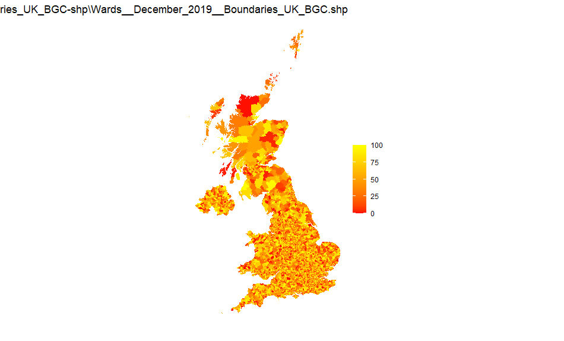

 
If there's one thing I love, it's maps (ok, that's many things). Combined with data and computers and I'm in heaven. I put these notes together for work but I felt they're worth sharing wider as there don't seem to be many very easy to follow guides to UK choropleths in R.

[Choropleths](https://en.wikipedia.org/wiki/Choropleth_map) are map charts where regions are filled in particular colours/shades according to data values. They are useful when comparing a numeric value from area to area. The alternative is a bubble map where points are placed at particular latitude/longitude pairs, and the points may vary in size, colour, or shape (or all three) according to data values. Bubble maps are relatively straightforward to plot as you merely need a shape file and the latitude/longitude pairs of each point. Choropleths need a shape file with a way of identifying each area so that data can be associated and then plotted. They are therefore a little more troublesome.

This note shows how to do this in R and has been developed starting from the ideas at [https://datatricks.co.uk/creating-maps-in-r-2019](https://datatricks.co.uk/creating-maps-in-r-2019).

## Package requirements

The following packages are required:

```
library(tidyverse)
library(rgdal)
library(broom)
```
  

## Sourcing shape files

Although there are some internal maps provided with R, this note concentrates on UK area maps for which shape files can be downloaded from a variety of places but for UK boundaries the best source is:

[https://geoportal.statistics.gov.uk/search?collection=Dataset&sort=name&tags=all(BDY_ADM)](https://geoportal.statistics.gov.uk/search?collection=Dataset&sort=name&tags=all(BDY_ADM))

In most cases the ultra-generalised boundaries will suffice - they are at 500m resolution, ward boundaries need 20m.

Files are provided in ZIP files, which have to be extracted for use. You will need all the files in the ZIP file extracted to a folder.

## Loading shape files

To load a shape file into R, use code like the following:

```
shp <- readOGR(dsn="maps/NUTS_Level_2_January_2018_Boundaries.shp")
mapdata <- tidy(shp, region="nuts218cd")
```

Note that although only the shp file is referenced, all files from the ZIP file must be in the same folder. You may get warning messages with tidy(), some of them can be ignored.

Do View(shp) to see the format of the shp file (it consists of several lists) and to check the names and IDs of each entity. In this case, we take the nuts218cd column as the entity reference. To merely get a column called id, use:

```
mapdata <- tidy(shp)
```

Look at mapdata to see how that is constructed - it's this data frame we will merge with our numeric data.

You can check whether the map has loaded ok by doing a quick plot:

```
ggplot(data = mapdata, aes(x = long,
 y = lat,
 group = group)) +
 geom_polygon(fill = "#FFFFFF", 
 colour = "#000000",
 size = 0.25) +
 coord_equal() +
 theme_void() 
```
  

Note that fill here refers to the internal colour of each area (this is important later), colour and size to the entity border. Because we don't need to associate colours to any data values, these settings can sit outside the aesthetic layer. To hide the entity border just set the colour to `#FFFFFF` (ie white). The group term is essential (try without it to see the impact).

The plot should look like this:


## Data files

Now you've got your map ready, all you need now is to prepare the data file. This needs to have a way of relating each data point to an entity in mapdata.

The following just creates a random number from 1 to 100 in mydata for each id (the raw ID not the entity name in mapdata):

```
mydata <- data.frame(id = unique(mapdata$id),
 value = sample(c(0:100), length(unique(mapdata$id)), replace = TRUE)) 
```
  
View this data frame to see what it looks like (it has two columns, one with a ID from the mapdata and one with a random number).

We then merge the two data frames together with a left join. We can use a left join's nature to either plot all map entities whether or not there is matching data, or only plot those areas with data (useful if you are only interested in a sub-set of the entire map).

To show all map entities with or without data, put mapdata first in the join:

```
df <- left_join(mapdata, mydata, by="id") 
```
  
To show only those map entities with data, put mydata first:

```
df <- left_join(mydata, mapdata, by="id") 
```
  

## Charts

To show the map with the merged data, use ggplot as follows:

```
ggplot(data = df,
 aes(
 x = long,
 y = lat,
 group = group,
 fill = value
 )) +
 geom_polygon(color = "#000000",
 size = 0.25) + scale_fill_gradient2(
 low = "blue",
 mid = "red",
 high = "yellow",
 na.value = "white"
 ) + coord_fixed(1) +
 labs(title = "A random plot",
 fill = "Random",
 caption = "A plot of random numbers") +
 theme_void() +
 theme(legend.position = "right")
```
  
Notes:

We're picking up the data values and the map data all from the merged data frame.

Fill has been moved in the aesthetics definition so that it varies with the value column.

This gives us:


You can plot a limited area either by only including data values for those and using the alternative left join above, or by limiting x and y (ie the latitude and longitude) with xlim and ylim respectively. You may wish to remove the theme_void() while doing this so that you have a scale to work from. Limiting x and y in this way also enables you to suppress areas which may be part of an entity eg the Scottish Islands.

Here we limit the source data to only have two areas filled in:

```
mydata <-
 data.frame(id = unique(mapdata$id),
 value = sample(c(0:100), length(unique(mapdata$id)), replace = TRUE)) %>% filter(id %in% c("1","2"))
```

Note that the id column is a character column hence we can't use id < 3 (although we could do as.numeric(id) < 3).

With the first form of left join:

```
df <- left_join(mapdata, mydata, by="id")
```
  
We get:


With the second:

```
df <- left_join(mydata, mapdata, by="id")
```
  
We get:


## Real data

The above example used random numbers, in practice we would of course use real data, probably coming from an Excel workbook or a CSV file, with the format:

```
Entity ID (or name), Entity value 
```
  

This would be merged in a similar way to above, although the left_join may need to be more complex if the two ID columns are named the same.

In practice, we would read in the file like so:

```
mydata <- read_xlsx("filename.xlsx") #requires readxl library
```

Or:

```
mydata <- read_csv("filename.csv")
```
  

See [Read_Excel](https://readxl.tidyverse.org/reference/read_excel.html) and [Read_delim](https://readr.tidyverse.org/reference/read_delim.html).

But for simplicity, let's create a simple dataframe with just two values:

```
mydata2 <- data.frame(entity=c("UKC1","UKC2"), value=c(100,50))
```

As the ID columns are named differently, join now needs a list to define which columns to match on:

```
df <- left_join(mapdata, mydata2, by=c("id" = "entity"))
```
  
Plotted using the same code as above gives:  


You may need to build up a library of lookup tables if data sources use entity IDs different from the shape files.

Some example maps with shape file source are shown below, all using random numbers as above. Production was added with the following code to get to the right folder and shape files (using the countries as an example):

```
sourcemap <- "Countries_December_2019_Boundaries_UK_BUC-shp"
sourcefile <- str_remove(sourcemap, "-shp")
sourcefile <- str_c("maps", sourcemap, "", sourcefile, ".shp")
```
  

Shape files were stored in folders within the project structure.

The map title was set to sourcemap in the plot definition.

## NUTS1

Source: NUTS_Level_1_January_2018_Boundaries-shp


## NUTS2

Source: NUTS_Level_2_January_2018_Boundaries-shp


## NUTS3

Source: NUTS_Level_3_January_2018_Boundaries-shp


## UK LA districts

Source: Local_Authority_Districts_December_2019_Boundaries_UK_BUC-shp

  

## UK Counties and Unitary Authorities

Source: Counties_and_Unitary_Authorities_December_2019_Boundaries_UK_BUC-shp


## UK countries

Source: Countries_December_2019_Boundaries_UK_BUC-shp


## UK wards

Source: Wards_December_2019_Boundaries_UK_BGC-shp

Note that this is a large file and has 20m resolution

The polygon geom definition for this is geom_polygon() - ie no boundary shown. Otherwise the boundaries overlap the area colour and large areas appear black.

