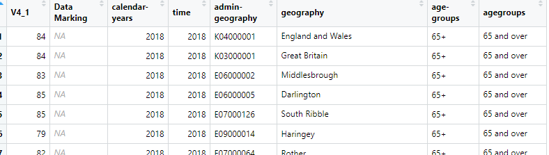
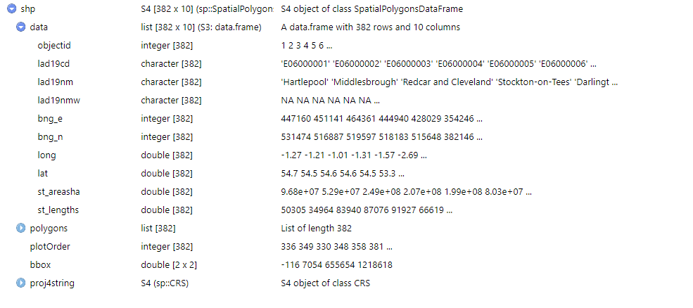
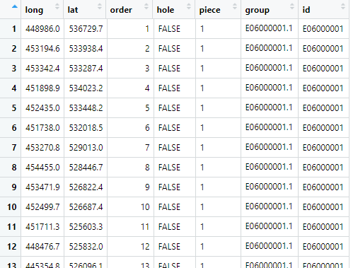
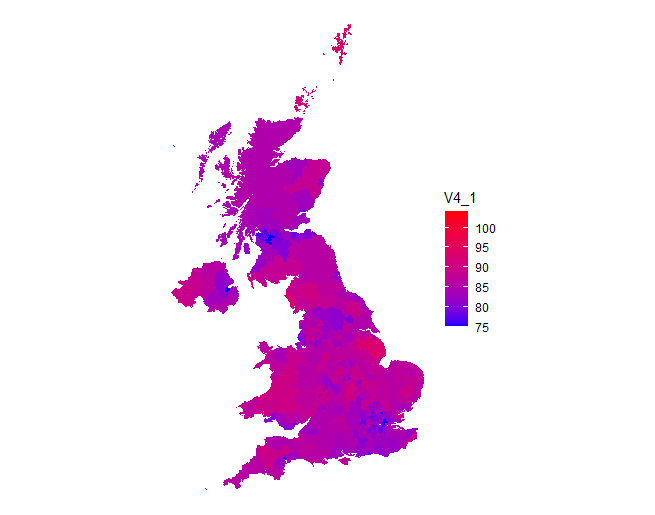

 
This follows on from the [previous post on UK choropleths](/creating-choropleth-maps-in-r-with-ggplot2), except now we'll be using real data.

Let's go and see what's out there at [https://www.ons.gov.uk/help/localstatistics](https://www.ons.gov.uk/help/localstatistics). Just chose an interesting dataset and download it. Let's download the data for older people sex ratios. Go to [https://www.ons.gov.uk/datasets/older-people-sex-ratios/editions/time-series/versions/1](https://www.ons.gov.uk/datasets/older-people-sex-ratios/editions/time-series/versions/1) and choose Other download options, Complete dataset (CSV format).

What does this dataset look like when downloaded into R?

```
library(tidyverse)
library(rgdal)
library(broom)

df <- read_csv("input//agesexratio.csv")
```

Note that read_csv spits back the column definitions it uses to parse the data and convert to different types. It is essential you always check this as the parsing can get fooled by blanks or other unexpected data in the first 1000 or so rows. You can then copy the column specification and alter it as appropriate into a col_types parameter for read_csv. See [https://readr.tidyverse.org/reference/read_delim.html](https://readr.tidyverse.org/reference/read_delim.html).

The data look like this:



If you scroll down a bit you'll see that the data are a mix of different levels (England and Wales, Great Britain, local authorities etc). That's ok as when we merge with an appropriate map table we can exclude any extra rows. The data also contains data for two age-groups - 65+ and 85+ and also some NAs in the main data column V4_1. We'll need to be aware of that before mapping.

We know from looking at the file that (some of) the data are at UK local authority level and we can see the relevant ID codes in the admin-geography column. It is this column we'll need to merge with the map data. Let's get that:

```
sourcemap <- "Local_Authority_Districts_December_2019_Boundaries_UK_BUC-shp" sourcefile <- str_remove(sourcemap, "-shp") sourcefile <- str_c("maps", sourcemap, "", sourcefile, ".shp") shp <- readOGR(dsn = sourcefile)
```

Before we tidy shp, we need to find out what the ID column is called. Use View(shp) or single-click on shp in the environment list. Remember that map shape files contain several lists - expand the data one thus:



We don't want the area names, merely the ID codes. These are in the lad19cd column, so we can tidy the shape file keeping that column:

```
mapdata <- tidy(shp, region = "lad19cd")
```

Mapdata looks like this:



We now want to merge this with the age sex ratio data, using the same left join technique as before. However, we also want to exclude the NAs and only have data for the 65+ ratios. Because we have tidyverse loaded we can do this in one pipe:
  
```
df2 <- df %>%
    filter(`age-groups` == "65+" & !is.na(V4_1)) %>%
    left_join(mapdata, by = c("admin-geography" = "id")) %>%
    filter(!is.na(order))
```

Taking that one line at a time:

1.  save the contents of everything that follows into df2, start with df
    
2.  then filter that so that age-groups is limited to 65+ and all NAs in column V4_1 are excluded (== means equal to, & means and, ! means not)
    
3.  then join the result of that with the map data, matching on the admin-geography and id columns
    
4.  then filter the result of that to exclude any rows where order is NA (ie where there is no corresponding map data - all those non-local authority rows).
    
The results of the entire pipe are saved into df2.

Note that the age-groups and admin-geography columns have been imported as non-standard R column names (you can't have a minus sign in a column name for obvious reasons). The tidyverse import functions will refer to such columns with surrounding back-quotes. If you are going to do a lot of analysis with such columns, it's better to rename them, otherwise you end up with slightly untidy code. I haven't bothered here. The join doesn't need the back-quotes since the merge columns are already surrounded by double quotes.

We can then plot the data with a simple map plot as before:

```
ggplot(data = df2,
       aes(
           x = long,
           y = lat,
           group = group,
           fill = V4_1
       )) +
    geom_polygon() +
    scale_fill_gradient(low="#0000ff",high="#ff0000") +
    coord_equal() +
    theme_void()
```
  


There's a lot you can do here to tart this up, change the legend title, add a plot title, change the colour scheme, etc.