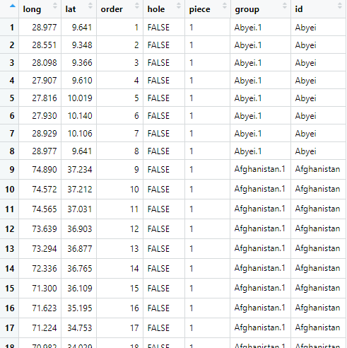
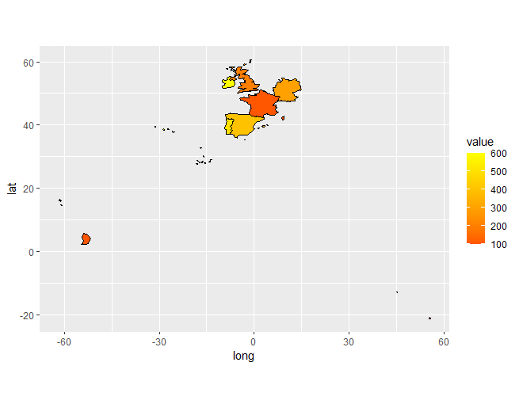

 
An appendum to my [previous post](/creating-choropleth-maps-in-r-with-ggplot2) in which I discussed UK choropleths in R.

Extending the methodology for UK maps to world maps is easy, There are world maps inbuilt in R but let's go get them from scratch. [Eurostat](https://ec.europa.eu/eurostat/web/gisco/geodata/reference-data/administrative-units-statistical-units/countries) has a collection of country maps. If you download and extract the 2016 country ZIP file you'll find that it contains different resolutions in separate folders. Here I load the 60 metre resolution file in the same way as I did for the UK maps:

```
library(tidyverse)
library(rgdal)
library(broom)

sourcefile <- "..mapsref-countries-2016-60m.shpCNTR_RG_60M_2016_4326.shp"

shp <- readOGR(dsn = sourcefile)
mapdata <- tidy(shp, region = "NAME_ENGL")
```

Note I've used the region parameter in tidy so the mapdata table is loaded with the id column containing the English country names:



Let's do a test plot:

```
ggplot(data = mapdata, aes(x = long,
                           y = lat,
                           group = group)) +
    geom_polygon(fill = "#FFFFFF", 
                 colour = "#000000",
                 size = 0.25) +
    coord_equal() +
    theme_void()
```

Which gives us:


We merge our data with the mapdata in exactly the same way as we did for the UK maps. Let's create a dummy dataset:

```
mydata <- data.frame(id = c("France", "United Kingdom", "Germany", "Spain", "Portugal", "Ireland"), value = c(100, 200, 300, 400, 500, 600))
```

and then merge it (using the alternative version that drops areas for which there are no data):

```
df <- left_join(mydata, mapdata, by="id")
```

We can then plot the map:

```
ggplot(data = df,
       aes(
           x = long,
           y = lat,
           group = group,
           fill = value
       )) +
    geom_polygon(color = "#000000", size = .25) +
    scale_fill_gradient2(
        low = "blue",
        mid = "red",
        high = "yellow",
        na.value = "white"
    ) + 
    coord_equal() +
    theme_void() +
    theme(legend.position = "right")
```

Which gives us an interesting problem:


What is going on? The mapdata table has non-mainland territories coded to the main country. If we want to exclude them, we could either identify them in the mapdata table and specifically exclude them or we could just change the map coordinates. Let's do the latter, comment out the theme_void() temporarily to show the latitude and longitude scales:



And then experiment to find the correct x and y limits to zoom in on the region we want:

```
ggplot(data = df,
       aes(
           x = long,
           y = lat,
           group = group,
           fill = value
       )) +
    geom_polygon(color = "#000000", size = .25) +
    scale_fill_gradient2(
        low = "blue",
        mid = "red",
        high = "yellow",
        na.value = "white"
    ) + 
    coord_equal() +
    theme_void() +
    theme(legend.position = "right") +
    ylim(36, 61) + 
    xlim(-12, 15)
```

While not perfect (it still shows non-mainland areas) this will do for now:


Note that any country with data missing is excluded from the map.