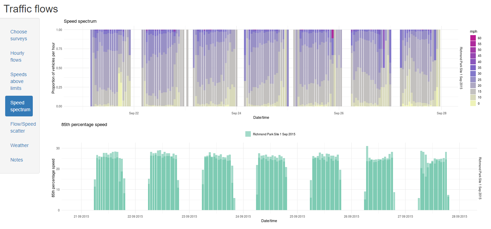

 
 I've been thinking of moving away from Power BI for a while for several reasons. First, there's nothing I like more than some change and learning a new package. Secondly, I felt that R just offers more flexibility when designing charts. So with that in mind, I've moved the visuals to [Shiny](https://rstudio.com/products/shiny), which is an app that enables you to publish your R work and make it interactive.

The new visuals are at [https://trafficflows.shinyapps.io/Traffic/](https://trafficflows.shinyapps.io/Traffic/), which in itself is a lot easier to remember than the obscure URL that Power BI used.

You need to select at least one survey and then click on Redraw. If you change any survey selection, you'll need to click on Redraw again. You can also select if you want to separately show the two directions for each survey or just merge them together.

This is very much work in progress but I think it's good enough to share at the moment. My to do list includes:

-   better handling of dates so it's easier to compare surveys
-   prettifying the speed/flow scatter plots
-   providing more notes (and bringing the current ones up to date)

I also want to write up my experience learning the little I have so far of Shiny. It's a great tool but with a few twists, so it will probably take a few posts and I don't have time at the moment.

I won't be updating the [old Power BI visuals](https://app.powerbi.com/view?r=eyJrIjoiZDc4NTg5MzMtODNjMC00NTFjLThjMDgtNWNjNzViNjY2ODM5IiwidCI6ImMyZGNiMzkwLTQ0YzEtNGVlNy1hMjk4LTQ0N2IwY2I4Mjg4ZiJ9&pageName=ReportSection) from now on and will take them down at some point. At least I don't have to keep switching between my work and personal accounts, which was driving me mad.

I'd love some feedback - my details are at the bottom of this blog.
