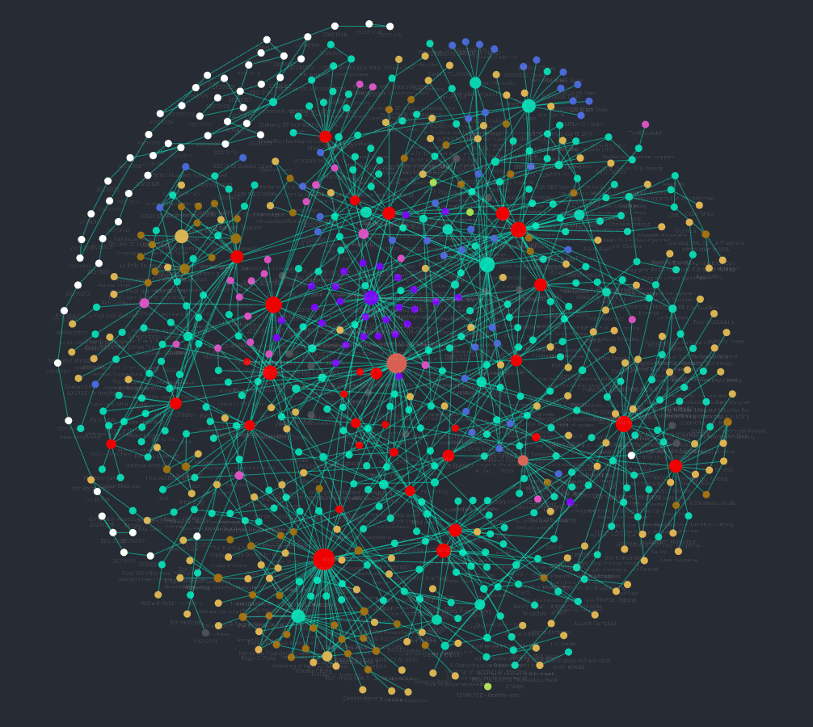

I've recently started using [Obsidian](https://obsidian.md/) for my notes. I was looking at Notion as a possible replacement for using a combination of OneNote and Google Keep but came across Obsidian and got hooked. Here are my thoughts after a month or so of using it.

## Why Obsidian?

First off, Obsidian is new, and to me new is always good. It's under very active development (it's still in beta but it's one of the most fully-featured beta products I've seen). Although it's not open source, the developers are very responsive and there is a very engaged community on the [forum](https://forum.obsidian.md/). In fact, that forum is perhaps both the most helpful and most thoughtful forum I've ever seen for an application or language. Perhaps that goes with the territory, many people using Obsidian are coming from other applications with different features and/or show the thinking that joined-up note-taking encourages. And the number of third-party plugins is rapidly increasing making for a very productive eco-system. At present Obsidian free and it looks like it will remain free for most uses.

## Where am I coming from?

I use OneNote a lot at work to document our systems, because it's a product that others can use without any special training and there are no IT Support issues about downloading novel software since it's a core Microsoft product. But it's clunky and I always fear the sudden loss of information due to accidental vandalism (it is backed up but small deletions are hard to detect). In addition, you're locked into a proprietary format - I don't think OneNote is going anywhere but you never know. I also tried using OneNote for small-scale home notes - like for school etc and for meeting notes. But I just didn't get on with it for those purposes. And don't forget the awful cut-down version they currently palm you off with (though it seems that is changing).

I've used Google Keep a lot over the years and it's great for small notes and reminders, and anything where you need to quickly record notes particularly on a phone. But it just doesn't have the linking of notes that good record keeping demands.

I read a lot of technical books and website articles and have never really made proper notes against them, with the result that I'm not properly learning. Using a Kindle, I can highlight parts of the book but then the notes are stuck on the device (or in read.amazon.com). Better if those were integrated with other notes. With Obsidian, I can download those notes and paste them into a note file.

I use Todoist for keeping track of work and household tasks and love the flexibility that it offers, including the easy integration with Alexa, and recurrent tasks.

## Obsidian

So where does Obsidian come in? It's an application that uses plain-text files with [Markdown](https://www.markdownguide.org/cheat-sheet/) to determine the formatting and linking. You can use it as a combination of a Wiki and a traditional note-taking application. You can file notes in separate folders if you want, you can use tags and you can link files using Wiki-type links (or the Markdown equivalent). Each file might be a long note on, eg a book, but could equally be a micro-note on a simple concept, or might just be an index that links various other files together. You might have daily journals or files which embed data from external systems, like the plugin which enables you to embed Todoist filters.

Installation is simple, just go to https://obsidian.md/ and follow the instructions there. You will need to create a folder in which to put your "vault", which is really just a collection of files and folders in which you want to put related material. You can have multiple vaults if you want but in many cases you will want to keep all your material in the same vault.

In the forum there are plenty of examples of how you might structure your folders (my ideas are shown below) but it's entirely your choice, and it's super-easy to move files around later as you come to terms with the way you want to work.

As the files exist on your own system, you can back them up anyway you want (and you really must back them up, after all this is your hard work). If you want to, the files can exist on OneDrive or some other cloud service and be automatically backed up. Or you can use Git to back them up and keep a record of each change that you make - a very powerful way of keeping track of how a note develops and back-tracking if necessary. Or any other back-up method you want.

The Obsidian application itself is like a hub to edit and manage these files and to switch between raw Markdown and preview mode (if you want). If you rename or move a file within Obsidian, then all links to that file are changed to point to the new name. You navigate through your links, or just open a file from the file explorer, or from the pop-up quick file opener (which remembers your recently opened files).

You can easily set up templates for different purposes, for example meeting notes or notes on a book, and it's a few key presses to include them into your current note. These templates can include fields, such as the current date, which get populated when the template is used.

For the hard-code, there is support for the [Zettelkasten](https://medium.com/@rebeccawilliams9941/the-zettelkasten-method-examples-to-help-you-get-started-8f8a44fa9ae6) method of note-taking.

## Markdown

Markdown is easy. In fact, you might have used elements of it elsewhere without thinking about it, particularly bullet points. Some simple concepts:

```**bold**``` becomes **bold**

```_italics_``` becomes _italics_

```
A simple bullet list:
- line 1
- line 2
- line 3
```
becomes

A simple bullet list:
- line 1
- line 2
- line 3

```
Todo items look like this:

- [ ] Uncompleted
- [x] completed
```

Todo items look like this:

- [ ] Uncompleted
- [x] completed

and they can be ticked off in preview mode.

```
A markdown link [looks like this](https://www.trafficflows.org)
```
A markdown link [looks like this](https://www.trafficflows.org)

But for links inside your Obsidian vault, you'll be better off using Wiki-type links:
```
A Wiki-type link to another file - [[Visual Studio Code]]
```
A Wiki-type link to another file - [[Visual Studio Code]]

You can *transclude* (ie embed) other files or parts of files by preceding the link with an exclamation mark.

There's a lot of excitement about changing the Obsidian editor to be more like [Typora](https://typora.io/), where editing shows the raw Markdown for the line you're editing but a preview of the output for everything else. I'm neutral on the benefits; looking at raw Markdown becomes very natural to me after a while.

Because Markdown is a plain-text format, you can use any method to edit the files *en masse* including scripting languages like Perl or Python or external text editors. But some of the new plugins, like Tag Wrangler, reduce the need to do this in any case.

## Mobile application
An Obsidian mobile application is under development and I'm really interested in what they come up with. In the absence of an official application, I'm using [Gitjournal](https://gitjournal.io/) on Android - this will connect with GitHub to get at my backup, permit me to edit files, and then commit and push the changes back to GitHub. Next time I'm in the desktop application, I can just pull the changes back down. All very nice, and because Git changes are fully logged, I have an extremely thorough method of tracing changes.

## Tags, links, folders
Your vault is your vault so you can do what you want with it. When starting out though, it's helpful to have a starting position. The forum (and elsewhere on the Internet) has lots of ideas on how best to structure your work. For what it's worth, this is what I do.

- **folders**
	- rather like GTD, I have an inbox folder for stuff I've just created and haven't yet decided where to file
	- a daily note folder - I'm trying really hard to do a daily journal
	- a monthly note folder - I really can't be bothered to do a weekly one
	- a todo folder - haven't really used this
	- Areas - broken down into (order is random not in importance!)
		- Children
		- Home
		- Work
		- Me
		- Family
	- Interests - subfolders are under development
		- Learning
		- Sport
		- Wellness
		- IT
	- Projects
		- Blog posts - the area where I draft and complete my blog
		- more to follow
	- Library
		- Authors - each author page is just a simple index to their books or articles below
		- Books - at least meta-data on them but usually notes and quotes
		- Web - ditto
		- Articles - ditto
	- Thoughts - those random snippets you want to capture
	- Attachments - images etc
	- Archive - older stuff (at the moment I just move older daily journals here)
	- Templates - the collection of templates I use

- **links** - links are the prime way I relate different notes together, either directly or via mini-index files (MOCs - map of contents) 
- **tags** - I use tags to denote the type of content or that something needs doing so I have tags like: 0/TODO or TYPE/AUTHOR. Of course, there's some redundancy here as author notes all ought to be in the author folder.

Remember though, it's easy to change to another way of working. If you wanted to use tags to denote the subject matter then that's up to you. The Zettelkasten method might lead you to a much flatter folder structure.

## Plugins
As I mentioned earlier, the plugin eco-system is rapidly developing. It's easy to browse and install these from within Obsidian and you can go to GitHub to see more information about each one, including tracking bugs and development.

A few of my favourites:

- **Obsidian Git** - provides a nice easy way of pushing and pulling changes to GitHub without using the command line or GitHub desktop
- **Advanced Tables** - Markdown tables can be a little tricky but this makes editing them very easy
- **Periodic Notes/Calendar** - these two provide improved functionality for daily, weekly or monthly journalling
- **Sliding Panes ** - a bit Marmite this one, sometimes I like it, sometimes I feel it doesn't work as I expect, but when it does work it makes the interface a bit swish
- **Templater** - an improved workflow for templates
- **Find unlinked files/Dangling links** - useful to track down notes that need linking
- **Todoist Plugin** - integrates Todoist filters so you can transclude these and the tasks just look like native todos. I don't see Obsidian todos replacing Todoist for me given the latter's much more complex functionality. But one advantage of this plugin is that I can finally copy the Alexa shopping list into plain text and paste it into the Sainsburys search filter.

There are plenty of other plugins I don't currently use. Of particular interest is Obsidian to Anki, which enables you to extract information from your vault and export it to Anki - a [spaced-repetition](https://collegeinfogeek.com/spaced-repetition-memory-technique/) application that I've used in the past both for my own purposes and for helping with learning difficulties.

There is so much other customisation you can do. You can remap keys to carry out commands, for example I've mapped toggling the left-hand sidebar to CTRL-1 and the right-hand to CTRL-0. There are plenty of themes and you can even add [CSS snippets](https://forum.obsidian.md/t/how-to-achieve-css-code-snippets/8474) to fine-tune the display.

## Graph view
No mention of Obsidian should be without a graph view, so here's mine, made nicer because the latest version provides the ability to colour by tag (or by other features):



It's fun to see all the links and to zoom around, but for me the most useful part of the graph is to see obviously unlinked files. There's a local graph view for each note, in which you can just see the links for that file, extending out to different depths if you want.

## Summary
Obsidian enables you to file and link notes quickly and thoroughly but doesn't tie you into a particular format. If Obsidian folded tomorrow, I'd still have my notes, and given they are in plain-text format, I can still read them with any editor and/or restructure them for another system.

To find out more about Obsidian then download it and play, it comes with a ready-made vault with loads of help. The forum is an amazing resource and extremely friendly to beginners and the expert alike. There are some excellent videos on YouTube including those by Bryan Jenks and "Linking your thinking", maybe start with the latter's [Obsidian for Beginners: Start HERE — How to Use the Obsidian App for Notes](https://www.youtube.com/watch?v=QgbLb6QCK88).
