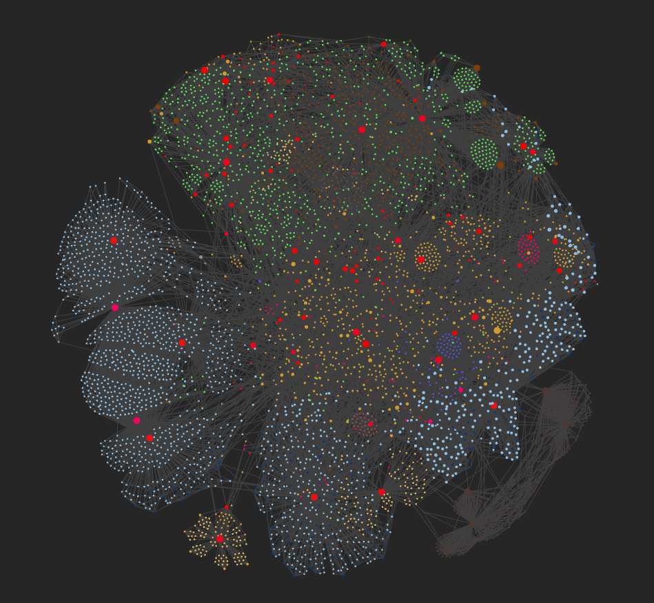

So I said I'm still using Obsidian, why have I kept at it for nearly 5 years when I'm normally such a flirt for apps?

## Local first

Perhaps the biggest reason people start using Obsidian is the way it stores your notes. And this was true for me. Everything lives right on your own device, giving you complete control over your files. They’re not locked away in some obscure format that only the official app can read, nor are they hidden on a cloud server you can’t fully access or back up. Instead, Obsidian works with simple text files stored locally, letting you handle them however you like - whether that’s tweaking, backing up, or even breaking things if you fancy.

## Text format

Obsidian saves your notes in plain text Markdown files, which means you can open them with any text editor. Simple options like Notepad work fine, or you can use something more advanced such as Visual Studio Code. In most cases, though, writing directly in the Obsidian app is all you need. Its built-in tools are more than enough for everyday use.

If you fancy experimenting, or you find yourself doing heavy editing work, an external editor can be handy. Still, those situations are pretty uncommon.

## Ease

The Obsidian interface is clean and easy to use, especially now that the live-preview mode is available. For most users, the Markdown format remains in the background and rarely needs direct attention. While it helps to understand a bit about Markdown for editing, you can get by comfortably without it.

## Value for money

Obsidian is free to use if you only need to edit files on your own device, and the team promises it will always stay that way. You have the option to buy extra features or support the developers if you wish. I suggest trying Obsidian Sync if you use more than one device. It makes it much simpler to keep your files up to date across all your devices, while your files remain stored locally.

Obsidian Sync works quietly in the background, making sure everything stays organised. Since your files are just text, you can edit the same file on two devices and Obsidian Sync will merge your changes, keeping everything consistent. However, if you change the exact same line on both devices at the same time, syncing may not work perfectly.

For what you get it's very low-cost.

## Sense of community

Learning a new application often depends on the quality of its online resources. In Obsidian’s case, the strong sense of community is a huge advantage. The Obsidian forums, in particular, are filled with helpful and highly knowledgeable users who are always ready to offer guidance. Whatever topic you want to explore more deeply, there’s almost always someone on the forums who knows the subject inside out.

## Always the chance for change within Obsidian

Perhaps the main reason I’ve stuck with Obsidian is its flexibility. You can shape it into whatever you need and adapt it as your priorities shift. As life and work evolve, certain paths in Obsidian become more relevant, while others fade away.

That’s certainly been true for me. I used to manage my work projects within Obsidian, but when my team moved to Monday.com, that system naturally came to an end. Even so, it served its purpose while it lasted.

Many of those old files still exist, though in varying forms. My daily journal, for instance, has been a constant for five years, yet its structure has changed significantly along the way. That’s the beauty of Obsidian - you have complete control over what you create, how you organise it, and the format that suits you best.

## Changes I've made over time

Over time, I’ve made quite a few changes to my workflow. I’ve already mentioned my daily journal, but I’ve also reworked how I manage tasks in Obsidian. That part is still evolving. When I first started using Obsidian, I relied on Todoist for personal task management. Later, I switched to TickTick. Between those two, I even used Obsidian itself to track tasks for a while. The problem with that approach was the lack of built-in notifications, although there are workarounds. Since I need reminders for certain to-do items, I eventually moved away from relying on Obsidian alone.

Another big change has been the sheer number of plugins I’ve experimented with. I’ve explored countless ones - some I used briefly before dropping, others have stuck around and become part of my routine. I plan to write a separate post soon about the plugins that have stayed with me.

## Extensibility

Those plugins are clearly one of Obsidian’s biggest strengths. You often see people on the forums worrying that using too many of them takes away from the simplicity and flexibility of plain text. There’s some truth to that. But your core information remains safe -  it’s all still stored as plain text. So even if certain plugins stop working or vanish as Obsidian evolves, your raw data stays intact.

## Mobile

It’s interesting to remember when I first wrote about Obsidian, the mobile app was still in development. Now, it’s been available for quite a while. Has this changed how I use Obsidian? To some degree, yes. It's great to have all my notes on tap wherever I am. But the mobile app is slow to launch, which puts me off using it often. Waiting three or four seconds for an app to start feels outdated. There’s also no background sync, so I have to open the app each time I want to update my notes. Honestly, this is a bit annoying. I know the developers are working on improvements, but for now, it’s a drawback.

## Structure – Folders vs Tags

My folder structure has shifted over time. As you use Obsidian more, you’ll discover different ways to organise your notes and may like me, pivot between a folder-based or a tag-based system, or most likely end up with a hybrid system like me. Some methods are more effective, while others simply suit personal preference. A well-chosen system can make it much easier to find what you need.

By default, and even more so with the right plugins, Obsidian offers an extremely powerful search function. Over the years, I’ve started to rely more on tags, but I still use folders as well. Balancing both helps keep things organised without feeling too restrictive.

## Graph View

Previously, I mentioned how the global graph view on Reddit sometimes turns into a competition, with users bragging about their sprawling note networks. It’s as though people want to prove their “graph” is bigger and more impressive than anyone else’s.

So here goes - for comparison, check the graph from my [earlier post](../posts/2021-02-13-using-obsidian) and the updated one from today. Notes that are no longer relevant have been dimmed out, but you can still see how everything fits together. This helps visualise the changes in my knowledge base at a glance. The lighter dots represent daily notes, the green notes represent articles and books, and the orange notes are concepts. Red notes are (generally) local indexes.

## Backing up

If you store important information in Obsidian, make sure to protect your data properly. The biggest trap is neglecting backups. Always follow basic backup principles: save your files in several places, including one off-site copy, such as a cloud storage service. Backups should be more than just copies - ideally opt for a system with version control, like Git, so you can recover from any mistake or unwanted change.

Obsidian does have sync tools, which are handy, but they’re not a replacement for real backups. While there’s some version history built in, it’s still best to ensure your notes are backed up separately. Because your notes are plain text files, you can use almost any backup method you prefer.

I've seen on the forums that several people have lost information because they ran different sync tools on the same set of files. The problem with this is that one tool can easily get confused and remove what another tool has just put in place.

Having control over your files means you’re also responsible for keeping them safe. If you’re just starting with Obsidian, set up your backup routine from day one. It’s a simple step that can save a lot of trouble later on.
