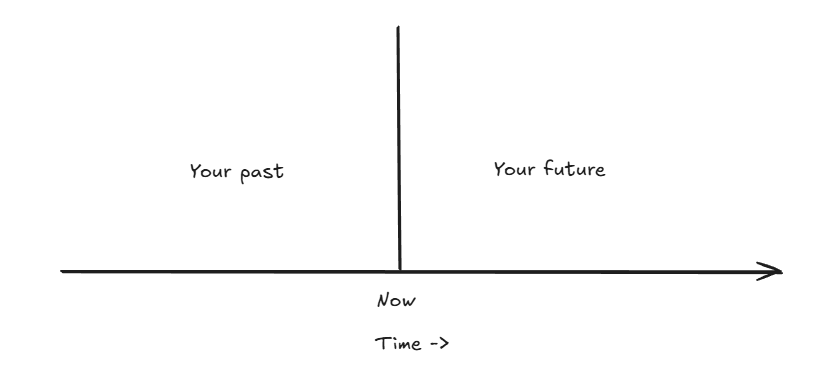
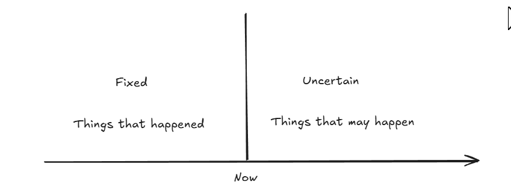
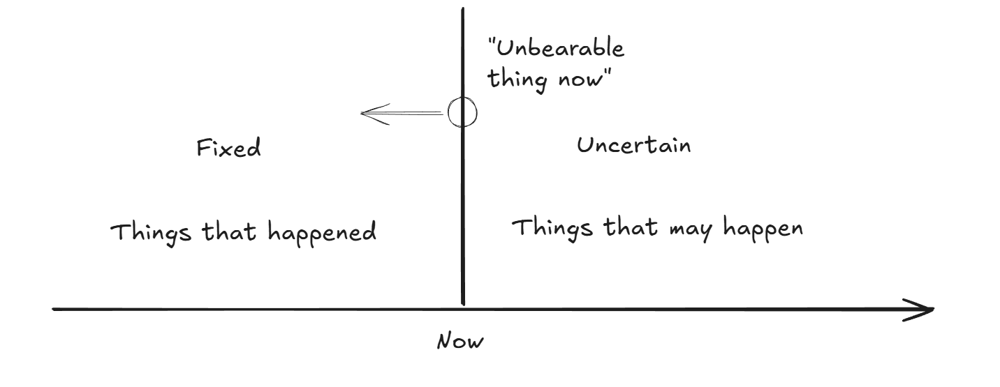

In the previous post, we explored the view from above, which helps us put things into perspective.  Let's move to another perspective - the view from the side, which is a timeline approach.

We can visualise a timeline stretching from left to right, with the past on the left and the future on the right. Currently, we are positioned between the past and the future - at now.

“For look to the immensity of time behind thee, and to the time which is before thee, another boundless space.” - Marcus Aurelius

The things that are in the past, they're fixed, they've happened. The things that are in the future are uncertain. They may happen, they may not happen.

“Life is divided into three periods — that which has been, that which is, that which will be. Of these the present time is short, the future is doubtful, the past is certain.” - Seneca

“Every man lives only this present time, which is an indivisible point, and that all the rest of his life is either past or it is uncertain.” - Marcus Aurelius

"Do not let the panorama of your life oppress you, do not dwell on all the various troubles which may have occurred in the past or may occur in the future. Just ask yourself in each instance of the present: ‘What is there in this work which I cannot endure or support?’" - Marcus Aurelius

"This too shall pass" - ancient Persian adage

What is so unbearable about the present? Have you suffered worse in the past and survived? What is happening now will pass, and will be a fixed thing that happened.

"Do not disturb yourself by imagining your whole life at once. Don’t always be thinking about what sufferings, and how many, might possibly befall you. Ask instead, in each present circumstance: 'What is there about this that is unendurable and unbearable?' You will be embarrassed to answer." - Marcus Aurelius

The present moment is fleeting. As soon as you began reading this, that moment passed, and we entered a new 'now.' This concept is echoed in many Stoic and Buddhist teachings. By adopting this timeline perspective, we can delve into various Stoic ideas. For instance, consider 'memento mori', a reminder of mortality that Roman emperors received:

“For all things soon pass away and become a mere tale, and complete oblivion soon buries them.” - Marcus Aurelius

Reflecting on the past, all individuals - whether famous or not, good or bad - are gone. Their time has ended. Countless people, relationships, and events have all turned to stardust. Looking ahead, the future holds numerous potential paths, both positive and negative. While we can predict some outcomes, many aspects of the future remain uncertain and highly improbable.

We can also contemplate the alternate pasts that could have been but never materialised. However, our actual past is fixed and unchangeable. There's no benefit in dwelling on past mistakes or embarrassments since they are irreversible and will not recur.  Neither should you dwell on the possible futures, by all means plan for them, but lessen the worry.

“So much of our unhappiness comes from ruminating over past events or worrying about possible future ones.” - Derren Brown

“Perhaps it will be, perhaps it will not be; meanwhile it is not.” - Farnsworth

Focusing on the present, this brief moment is all we truly have. The past is set and unalterable. Dwelling on it in ways that spoil the present and future is unproductive. What can you do? Accept that the past is irreversible. Choose to feel better about it. That's within your control. As for the future, while it is uncertain, you can prepare for potential challenges to some extent and reduce your worries about what lies ahead. But keep your mind as much in the present as possible. Or more prosaically: 

If you have one foot in the past and one foot in the present, then you piss on the present - Malachy McCourt
